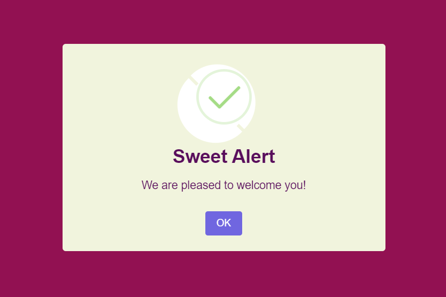
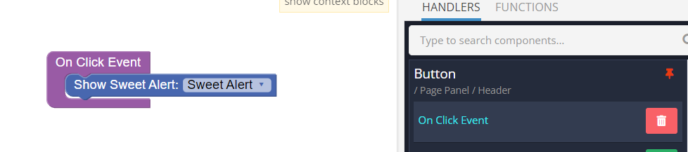
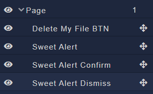
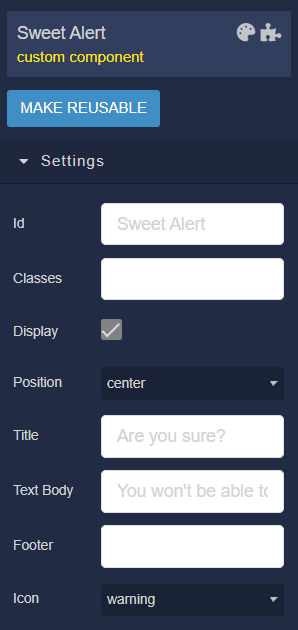
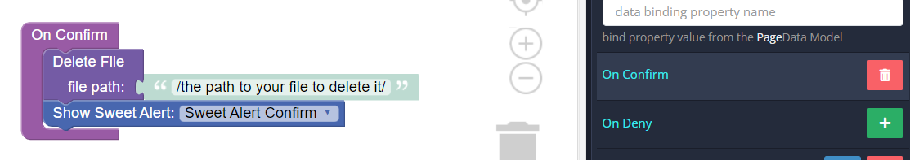
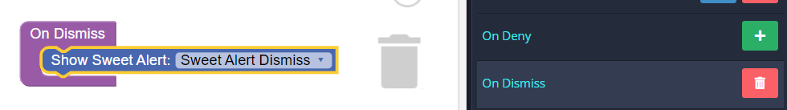
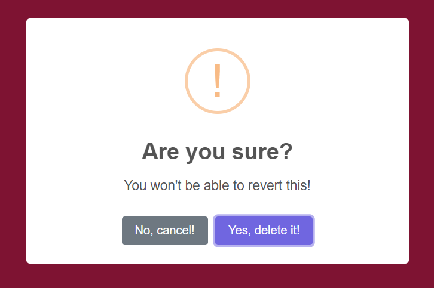
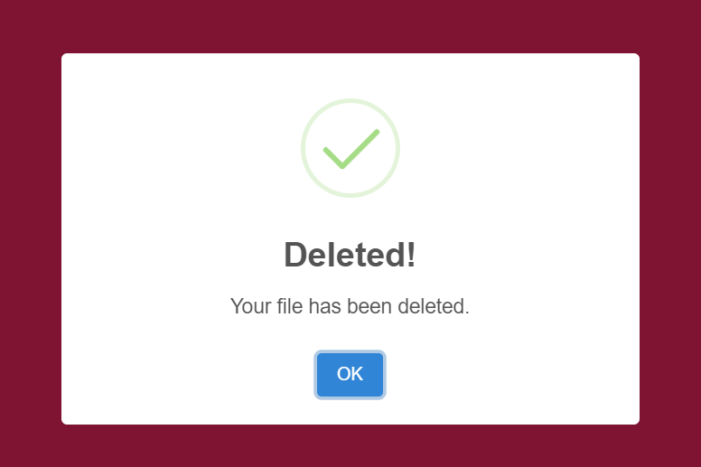
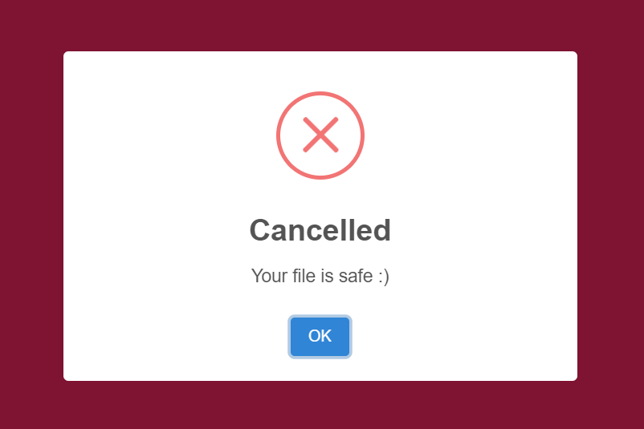

# Sweet Alert
Sweet Alert is the component that can be used in Backendless [UI-Builder](https://backendless.com/developers/#ui-builder). It allows you to use a beautiful, responsive, accessible replacement for javascript's popup boxes.
More information about this popup can be found in the [Sweet Alert 2](https://sweetalert2.github.io/) library, and it will also guide you through the process of creating this component.

<p align="center">
  
</p>

## Properties

| Property                                      | Type                                                                                                                          | Default value                                                                                                                                                                                                     | Logic                     | Data Binding | UI Setting | Description                                                                                                                                                                                               |
|-----------------------------------------------|-------------------------------------------------------------------------------------------------------------------------------|-------------------------------------------------------------------------------------------------------------------------------------------------------------------------------------------------------------------|---------------------------|--------------|------------|-----------------------------------------------------------------------------------------------------------------------------------------------------------------------------------------------------------|
| Position <br> `position`                      | *Select* <br> [`top`, `top-start`, `top-end`, `center`, `center-start`, `center-end`, `bottom`, `bottom-start`, `bottom-end`] | `center`                                                                                                                                                                                                          |                           | NO           | YES        | Controls the popup window position.                                                                                                                                                                       |
| Title <br> `title`                            | *Text*                                                                                                                        | `Sweet Alert`                                                                                                                                                                                                     | Title Logic               | YES          | YES        | This logic allows to specify a title of the popup, as text or HTML.                                                                                                                                       |
| Text Body <br> `text`                         | *Text*                                                                                                                        | `We are pleased to welcome you!`                                                                                                                                                                                  | Text Body Logic           | YES          | YES        | This logic allows to specify a description for the popup.                                                                                                                                                 |
| Footer <br> `footer`                          | *Text*                                                                                                                        |                                                                                                                                                                                                                   | Footer Logic              | YES          | YES        | This logic allows to specify a footer of the popup. Can be either plain text or HTML.                                                                                                                     |
| Icon <br> `icon`                              | *Select* <br> [`success`, `error`, `info`, `warning`, `question`, `none`]                                                     | `success`                                                                                                                                                                                                         |                           | NO           | YES        | Controls the icon of the popup.                                                                                                                                                                           |
| Icon Color <br> `iconColor`                   | *Color*                                                                                                                       |                                                                                                                                                                                                                   |                           | NO           | YES        | Controls the color of the popup icon.                                                                                                                                                                     |
| Backdrop <br> `backdrop`                      | *Checkbox*                                                                                                                    | `true`                                                                                                                                                                                                            | Backdrop Logic            | YES          | YES        | This logic allows to specify whether or not the component should show a full screen click-to-dismiss backdrop. Can be either a boolean or a string which will be assigned to the CSS background property. |
| Allow Outside Click <br> `allowOutsideClick`  | *Checkbox*                                                                                                                    | `true`                                                                                                                                                                                                            |                           | NO           | YES        | Controls whether the user can dismiss the popup by clicking outside it by default (requires `backdrop` parameter to be set to `true`) or not.                                                             |
| Allow Escape Key <br> `allowEscapeKey`        | *Checkbox*                                                                                                                    | `true`                                                                                                                                                                                                            |                           | NO           | YES        | Controls whether the user can dismiss the popup by pressing the `Esc` key by default (requires `allowEnterKey` parameter to be set to `true`) or not.                                                     |
| Allow Enter Key <br> `allowEnterKey`          | *Checkbox*                                                                                                                    | `true`                                                                                                                                                                                                            |                           | NO           | YES        | Controls whether the user can confirm the popup by pressing the `Enter` or `Space` keys by default or not, unless they manually focus the confirm button.                                                 |
| Buttons Settings <br> `buttonsSettings`       | *JSON*                                                                                                                        | [Default Buttons Settings](#default-buttons-settings)                                                                                                                                                             | Buttons Settings Logic    | YES          | YES        | This logic allows to specify the settings on the "Confirm", "Deny", "Cancel", "Close" buttons.                                                                                                            |
| Grow <br> `grow`                              | *Select* <br> [`row`, `column`, `fullscreen`, `none`]                                                                         | `none`                                                                                                                                                                                                            |                           | NO           | YES        | Controls the direction the popup should grow in. Paired with window position.                                                                                                                             |
| Additional Settings <br> `additionalSettings` | *JSON*                                                                                                                        | `{ "showClass": { "popup": "swal2-show", "backdrop": "swal2-backdrop-show", "icon": "swal2-icon-show" }, "hideClass": { "popup": "swal2-hide", "backdrop\": "swal2-backdrop-hide", "icon": "swal2-icon-hide" } }` | Additional Settings Logic | YES          | YES        | This logic allows to specify the additional popup settings.                                                                                                                                               |

## Default Buttons Settings

```
{
  "showConfirmButton": true,
  "confirmButtonText": "OK",
  "confirmButtonColor": "#3085d6",
  "confirmButtonAriaLabel": "",
  "focusConfirm": true,
  "showDenyButton": false,
  "denyButtonText": "No",
  "denyButtonColor": "#dd6b55",
  "denyButtonAriaLabel": "",
  "focusDeny": false,
  "showCancelButton": false,
  "cancelButtonText": "Cancel",
  "cancelButtonColor": "#aaa",
  "cancelButtonAriaLabel": "",
  "focusCancel": false,
  "showCloseButton": false,
  "closeButtonHtml": "&times;",
  "closeButtonAriaLabel": "Close this dialog"
}
```

## Events

| Name       | Triggers                                                             | Context Blocks             |
|------------|----------------------------------------------------------------------|----------------------------|
| On Confirm | when the "Confirm" button was clicked.                               | value: `Boolean \| String` |
| On Deny    | when the "Deny" button was clicked.                                  | value: `Boolean`           |
| On Dismiss | when there is any reason to dismiss("Close", "Cancel", `Esc`, etc.). | dismiss: `String`          |

## Actions

| Action            | Inputs | Returns |
|-------------------|--------|---------|
| Show Sweet Alert  |        |         |
| Close Sweet Alert |        |         |

## Styles

````
@bl-customComponent-sweet-alert-width: 32em;
@bl-customComponent-sweet-alert-padding: 0 0 1.25em;
@bl-customComponent-sweet-alert-color: #545454;
@bl-customComponent-sweet-alert-background: #fff;
@bl-customComponent-sweet-alert-fontFamily: Roboto, sans-serif;
@bl-customComponent-sweet-alert-border: none;
@bl-customComponent-sweet-alert-borderRadius: 5px;

@bl-customComponent-sweet-alert-icon-width: 5em;
@bl-customComponent-sweet-alert-icon-height: 5em;

@bl-customComponent-sweet-alert-title-fontSize: 1.875em;
@bl-customComponent-sweet-alert-title-fontWeight: 600;
@bl-customComponent-sweet-alert-title-margin: 0;
@bl-customComponent-sweet-alert-title-padding: 0.8em 1em 0;
@bl-customComponent-sweet-alert-title-color: inherit;

@bl-customComponent-sweet-alert-html-container-margin: 1em 1.6em 0.3em;
@bl-customComponent-sweet-alert-html-container-padding: 0;
@bl-customComponent-sweet-alert-html-container-color: inherit;
@bl-customComponent-sweet-alert-html-container-fontSize: 1.125em;

@bl-customComponent-sweet-alert-footer-margin: 1em 0 0;
@bl-customComponent-sweet-alert-footer-padding: 1em 1em 0;
@bl-customComponent-sweet-alert-footer-borderTop: 1px solid #eee;
@bl-customComponent-sweet-alert-footer-color: inherit;
@bl-customComponent-sweet-alert-footer-fontSize: 1em;
@bl-customComponent-sweet-alert-footer-wordBreak: break-word;
````

## Usage

Add a component to the page, add all the settings you need.
To make the popup window run, add, for example, to the button `On Click` event action `Show Sweet Alert`.

<p align="center">
  
</p>

## Examples

Let's look at an example confirmation alert to confirm file deletion.
To do this, let's take the `Delete My File` button, by clicking on which the main alert will be called, and two more alerts that will work to confirm and cancel the action, respectively.

<p align="center">
  
</p>

To configure the main Sweet Alert, add the following settings:

- basic - `{ title: 'Are you sure?', text: 'You won't be able to revert this!', icon: 'warning' }`

<p align="center">
  
</p>

- customization of buttons:
  1. using JSON
    ```
    {
      "showConfirmButton": true,
      "showCancelButton": true,
      "confirmButtonText": "Yes, delete it!",
      "cancelButtonText": "No, cancel!",
      "reverseButtons": true
    }
    ```
  2. using Buttons Settings Logic

<p align="center">
    
</p>

<details>
  <summary>Codeless Block XML</summary>

  ```
  <block xmlns="http://www.w3.org/1999/xhtml" type="create_object" id="Jf!ewqjdffQtumIgw]_%" x="194.9250030517578" y="100"><mutation><properties><item id="property" prop-name="showConfirmButton"></item><item id="property" prop-name="showCancelButton"></item><item id="property" prop-name="confirmButtonText"></item><item id="property" prop-name="cancelButtonText"></item><item id="property" prop-name="reverseButtons"></item></properties></mutation><value name="create_object_mutator_container_properties_stack_property0"><block type="logic_boolean" id="8}_JOH:%c9A/0[5:~G`a"><field name="BOOL">TRUE</field></block></value><value name="create_object_mutator_container_properties_stack_property1"><block type="logic_boolean" id="]sQGs9lYjG(zfJS%$1RU"><field name="BOOL">TRUE</field></block></value><value name="create_object_mutator_container_properties_stack_property2"><block type="text" id="j*A#OL=/karUz(pC%{,("><field name="TEXT">Yes, delete it!</field></block></value><value name="create_object_mutator_container_properties_stack_property3"><block type="text" id=",Yh3:9H82Y3Ir_3!r@o]"><field name="TEXT">No, cancel!</field></block></value><value name="create_object_mutator_container_properties_stack_property4"><block type="logic_boolean" id="ZO^N)g6b=dqNfWloROd|"><field name="BOOL">TRUE</field></block></value></block>
  ```
</details>

- adding logic for confirm and dismiss:

<p align="center">
    
</p>

<p align="center">
    
</p>

As a result, we get a Sweet Alert of this kind:

<p align="center">
    
</p>

The next step is to set up `Sweet Alert Confirm` and `Sweet Alert Dismiss` by adding the appropriate parameters in the same way as in the main Sweet Alert:

Sweet Alert Confirm - `{ title: 'Deleted!', text: 'Your file has been deleted.', icon: 'success' }`
Sweet Alert Dismiss - `{ title: 'Cancelled', text: 'Your file is safe :)', icon: 'error' }`

Thus, when confirming on the main Sweet Alert, a `Sweet Alert Confirm` will appear.

<p align="center">
    
</p>

And with dismiss, a `Sweet Alert Dismiss`.

<p align="center">
    
</p>
