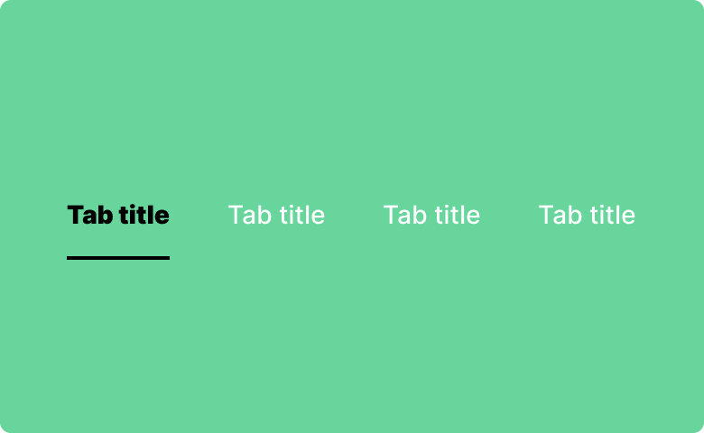
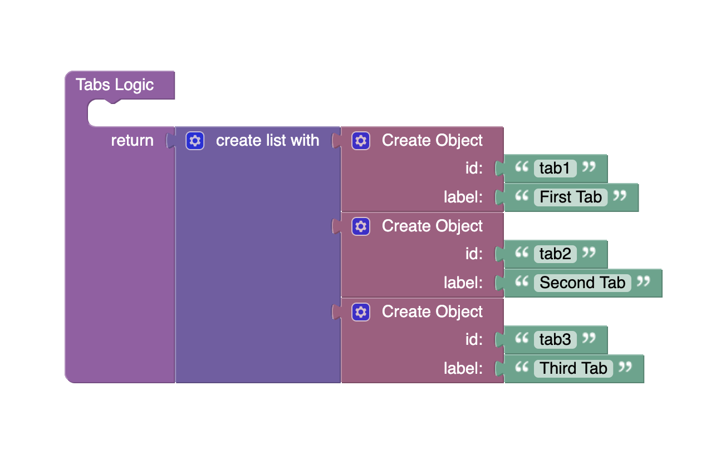
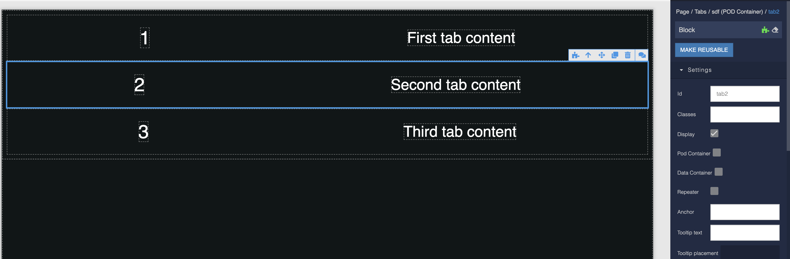
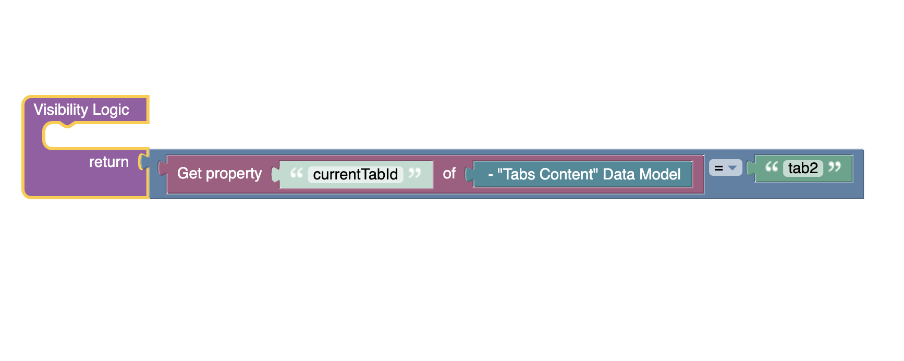

# Tabs

Tabs is a component of Backendless UI-Builder designer. This component make it easy to explore and switch between different views by selecting a different tab.

<p align="center">
  
</p>

## Properties

| Property         | Type                                               | Default Value | Logic          | Data Binding | UI Setting | Description                                                                                                                                        |
|------------------|----------------------------------------------------|---------------|----------------|--------------|------------|----------------------------------------------------------------------------------------------------------------------------------------------------|
| Disabled         | *Checkbox*                                         | `false`       | Disabled Logic | YES          | YES        | This handler allows you to disable a component.                                                                                                    |
| Variant          | *Select* <br/>"Standart" \| "Filled" \| "Outlined" | "Standart"    | Variant Logic  | YES          | YES        | This handler allows you to select variant of tab.                                                                                                  |
| Tabs Orientation | *Select* <br/>"Left" \| "Center" \| "Right"        | "Center"      |                | NO           | YES        | This handler allows you to specify the orientation of the tabs.                                                                                    |
| Tabs             | *JSON*                                             |               | Tabs Logic     | YES          | YES        | This handler allows you to add tabs buttons to component. Watch [Codeless Examples](#Examples). Signature of tab: {id: `String`, label: `String`}. |

## Events

| Name                  | Triggers                        | Context Blocks               |
|-----------------------|---------------------------------|------------------------------|
| On Change Event       | triggered when a tab is changed | Current Tab Id: `String`     |

## Actions

| Action                | Inputs                          | Returns                      |
|-----------------------|---------------------------------|------------------------------|
| Set Current Tab Id    | Id: `String`                    |                              |
| Get Current Tab Id    |                                 | `String`: current tab id     |

## Styles

**Theme**
````
@bl-customComponent-tabs-themeColor: @themePrimary;
@bl-customComponent-tabs-backgroundColor: @appBackgroundColor;
@bl-customComponent-tabs-textColor: @appTextColor;
````

**Dimensions**
````
@bl-customComponent-tabs-fontSize: 14px;
````

**Colors**
````
@bl-customComponent-tabs-backgroundColor: rgba(@themePrimary, 0.15);
````

## <a name="Examples"></a> Codeless Examples

Adding of tabs to the component:



Adding of tabs content to component:



Controlling the visibility of the tab's content:


