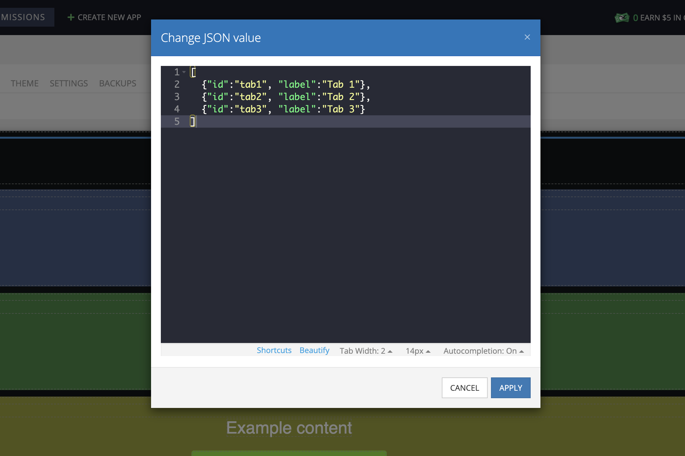
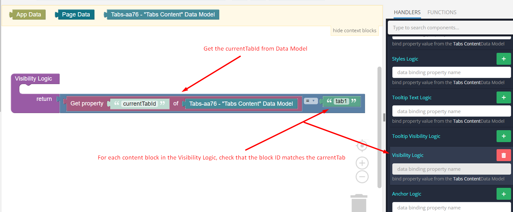

# Tabs

Tabs is a component of Backendless UI-Builder designer. This component make it easy to explore and switch between different views by selecting a different tab.

<p align="center">
  
</p>

## Demo

View an example of how to install this component and how it works in your UI [here](https://app.arcade.software/share/EqZKce9osFg9qAyND8vc).

## Properties

| Property         | Type                                               | Default Value | Logic                | Data Binding | UI Setting | Description                                                                                                                                  |
|------------------|----------------------------------------------------|---------------|----------------------|--------------|------------|----------------------------------------------------------------------------------------------------------------------------------------------|
| Disabled         | *Checkbox*                                         | `false`       | Disabled Logic       | YES          | YES        | This handler allows you to disable a component.                                                                                              |
| Variant          | *Select* <br/>"Standard" \| "Filled" \| "Outlined" | "Standard"    | Variant Logic        | YES          | YES        | This handler allows you to select variant of tab.                                                                                            |
| Tabs Orientation | *Select* <br/>"Left" \| "Center" \| "Right"        | "Center"      |                      | NO           | YES        | This handler allows you to specify the orientation of the tabs.                                                                              |
| Tabs             | *JSON*                                             |               | Tabs Logic           | YES          | YES        | This handler allows you to add tabs buttons to component. Watch [Usage Guide](#Examples). Signature of tab: {id: `String`, label: `String`}. |
| Current Tab Id   | *Text*                                             | "tab1"        | Current Tab Id Logic | YES          | YES        | This handler allows you to determine the current tab.                                                                                        |

## Events

| Name              | Triggers                                    | Context Blocks               |
|-------------------|---------------------------------------------|------------------------------|
| On Change Event   | triggered when a tab is changed             | Current Tab Id: `String`     |
| On Mounted        | triggered after the component is mounted    |                              |
| On Before Unmount | triggered before the component is unmounted |                              |

## Actions

| Action                | Inputs                          | Returns                      |
|-----------------------|---------------------------------|------------------------------|
| Set Current Tab Id    | Id: `String`                    |                              |
| Get Current Tab Id    |                                 | `String`: current tab id     |

## Styles

**Theme**
````
@bl-customComponent-tabs-themeColor: @themePrimary;
@bl-customComponent-tabs-backgroundColor: @appBackgroundColor;
@bl-customComponent-tabs-textColor: @appTextColor;
````

**Dimensions**
````
@bl-customComponent-tabs-fontSize: 14px;
````

**Colors**
````
@bl-customComponent-tabs-backgroundColor: rgba(@themePrimary, 0.15);
````

## <a name="usage-guide"></a> Usage Guide

Add tabs to the component. You can add tabs using component logic. Note: Be sure to place blocks of tabs for Tab1, Tab2, and so on INSIDE the Tabs component. The Tabs component uses the Backendless POD feature, which requires proper nesting of UI components.


Or using JSON:



Add a content block for each tab:


Specify for each content block the ID that you specified for the tab:


In the logic of each content block in the "Visibility Logic" tab, check whether the block Id matches "currentTabId":


