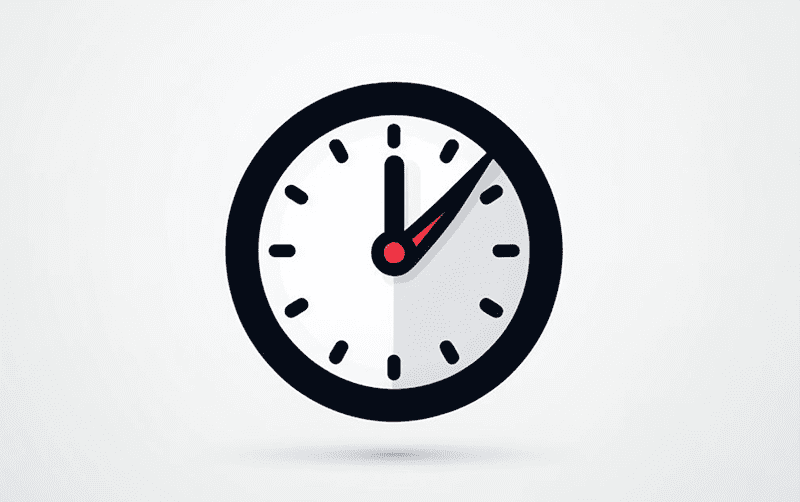

# Timer

This is a component for Backendless [UI-Builder](https://backendless.com/developers/#ui-builder). It allows you to
display a digital timer and trigger an event when it completes. You can use it as a countdown.

<p align="center">
  
</p>

## Demo

View an example of how to install this component and how it works in your UI [here](https://app.arcade.software/share/WPJdsvldiTe3HmNXHueu).

## Properties

| Property                                     | Type                                                                                                                                                                                      | Default Value                     | Logic                    | Data Binding | UI Setting | Description                                                                                                       |
|----------------------------------------------|-------------------------------------------------------------------------------------------------------------------------------------------------------------------------------------------|-----------------------------------|--------------------------|--------------|------------|-------------------------------------------------------------------------------------------------------------------|
| Simple Timer: `simpleTimer`                  | Text                                                                                                                                                                                      | "00:05:00"                        | Simple Timer Logic       | YES          | YES        | Allows to determine a regular timer. Format of timer: `HH:MM:SS`.                                                 |
| Countdown: `countdown`                       | Text                                                                                                                                                                                      |                                   | Countdown Logic          | YES          | YES        | Allows you to specify the date, time, and time zone when the timer will expire. Signature `MM.DD.YY HH:MM:SS UTC` |
| Animation Duration (ms): `animationDuration` | Number                                                                                                                                                                                    | 400                               | Animation Duration Logic | YES          | YES        | Allows to determine the duration of the animation to change the time.                                             |
| Format: `format`                             | Select ["SS": `seconds`, "MM:SS": `minutesSeconds`, "HH:MM:SS": `hoursMinutesSeconds`, "Days HH:MM:SS": `daysHoursMinutesSeconds`, "Weeks Days HH:MM:SS": `weeksDaysHoursMinutesSeconds`] | "HH:MM:SS": `hoursMinutesSeconds` | Format Logic             | NO           | YES        | Allows to determine the time format of the timer.                                                                 |

## Events

| Name         | Triggers                                | Context Blocks |
|--------------|-----------------------------------------|----------------|
| On Timer End | This event triggers when the timer ends |                |

## Actions

| Action                      | Inputs | Returns                                                                                    |
|-----------------------------|--------|--------------------------------------------------------------------------------------------|
| Start Simple Timer          |        |                                                                                            |
| Stop Simple Timer           |        |                                                                                            |
| Reset Simple Timer          |        |                                                                                            |
| Get Actual Value from Timer |        | { weeks: `Number`, days: `Number`, hours: `Number`, minutes: `Number`, seconds: `Number` } |

## Styles

**Dimensions**

```
@bl-customComponent-clock-font-size: 16px;
```

**Color**

```
@bl-customComponent-clock-text-color: @appTextColor;
```
