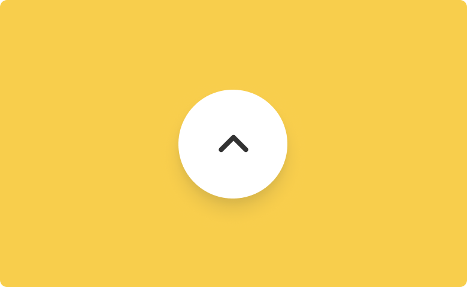

# Totop

Totop is the component that can be used in Backendless [UI-Builder](https://backendless.com/developers/#ui-builder). It allows you to use the up button to scroll up the page or scroll up to a specific page element.

<p align="center">
  
</p>

## Properties

| Property                          | Type                                                                                                                                 | Default value  | Logic                     | Data Binding | UI Setting | Description                                                                                           |
|-----------------------------------|--------------------------------------------------------------------------------------------------------------------------------------|----------------|---------------------------|--------------|------------|-------------------------------------------------------------------------------------------------------|
| Position <br> `position`          | *Select* <br> [`bottom-right`, `bottom-left`, `bottom-center`, `top-right`, `top-left`, `top-center`, `center-right`, `center-left`] | `bottom-right` |                           | NO           | YES        | Controls the position of the up button on the page.                                                   |
| Element <br> `element`            |                                                                                                                                      |                | Scroll To Component Logic | NO           | NO         | The logic to determine the element to which the scroll will be. Watch [Codeless Examples](#Examples). |
| Offset <br> `offset`              | *Number*                                                                                                                             |                | Offset Logic              | YES          | YES        | Controls the scroll offset.                                                                           |
| Background <br> `backgroundColor` | *Color*                                                                                                                              |                | Background Color Logic    | YES          | YES        | Controls the up button background.                                                                    |
| Color <br> `color`                | *Color*                                                                                                                              |                | Color Logic               | YES          | YES        | Controls the color of the icon inside the up button.                                                  |
| Button Size <br> `size`           | *Text*                                                                                                                               | `40px`         | Size Logic                | YES          | YES        | Controls the size(width/height) of the up button, in px.                                              |
| Icon Size <br> `iconSize`         | *Text*                                                                                                                               | `20px`         | Icon Size Logic           | YES          | YES        | Controls the size(width/height) of the icon inside the up button, in px.                              |
| Indent X <br> `indentX`           | *Text*                                                                                                                               |                | Indent X Logic            | YES          | YES        | Controls the indent of the up button from the edge of the page horizontally.                          |
| Indent Y <br> `indentY`           | *Text*                                                                                                                               |                | Indent Y Logic            | YES          | YES        | Controls the indent of the up button from the edge of the page vertically.                            |

## Actions

| Action             | Inputs | Returns |
|--------------------|--------|---------|
| Hide Scroll Button |        |         |
| Show Scroll Button |        |         |

## Styles

**Theme**
````
@bl-customComponent-totop-theme: @themePrimary;
@bl-customComponent-totop-themeTextColor: @appTextColor;
````

**Dimensions**
```
@bl-customComponent-totop-size: 40px;
@bl-customComponent-totop-icon-size: 20px;
@bl-customComponent-totop-indent: 20px;
@bl-customComponent-totop-border-radius: 50%;
@bl-customComponent-totop-z-index: 999;
```

**Colors**
````
@bl-customComponent-totop-background-color: if(@isLightTheme, rgba(0, 0, 0, 0.04), rgba(255, 255, 255, 0.04));
@bl-customComponent-totop-hover-background-color: fade(@bl-customComponent-totop-background-color, 20%);
````

**Other**
````
@bl-customComponent-totop-cursor: pointer;
````

## Usage

Make sure the page overflow is not set. In addition, the scrolling target should not be hidden by any parent element.

<p align="center">
  
</p>

## Examples

Below is a Codeless Example highlighting how to use the Totop component:

<p align="center">
  
</p>
