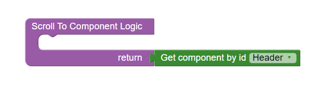

# Totop

Totop is the component that can be used in Backendless [UI-Builder](https://backendless.com/developers/#ui-builder). It allows you to use the up button to scroll up the page or scroll up to a specific page element.

<p align="center">
  
</p>

## Properties

| Property   | Type                                                | Default value  | Logic                      | Data Binding | UI Setting | Description                                                       |
|------------|-----------------------------------------------------|----------------|----------------------------|--------------|------------|-------------------------------------------------------------------|
| Position   | *Select* <br> `'bottom-right'` <br> `'bottom-left'` | `bottom-right` | Type Logic                 | NO           | YES        | Controls the position of the up button on the page.               |
| Element    | *JSON* <br> `{...}`                                 |                | Element To Scroll To Logic | NO           | NO         | The logic to determine the element to which the scroll will be.   |
| Offset     | *Number*                                            | `0`            |                            | NO           | YES        | Controls the scroll offset.                                       |
| Background | *Color*                                             |                |                            | NO           | YES        | Controls the up button background.                                |
| Color      | *Color*                                             |                |                            | NO           | YES        | Controls the color of the icon inside the up button.              |
| Icon Size  | *Text*                                              | `24px`         |                            | NO           | YES        | Controls the size(width/height) of the icon inside the up button. |
| Padding    | *Text*                                              | `10px`         |                            | NO           | YES        | Controls the indent inside the up button.                         |
| Indent     | *Text*                                              | `30px`         |                            | NO           | YES        | Controls the indent of the up button from the edge of the page.   |

## Styles

**Theme**
````
@bl-customComponent-totop-theme: @themePrimary;
@bl-customComponent-totop-themeTextColor: @appTextColor;
````

**Dimensions**
```
@bl-customComponent-totop-size: 20px;
```

**Colors**
````
@bl-customComponent-totop-background-color: if(@isLightTheme, rgba(0, 0, 0, 0.04), rgba(255, 255, 255, 0.04));
@bl-customComponent-totop-hover-background-color: fade(@bl-customComponent-totop-background-color, 20%);
````

## Examples

Below is a Codeless Example highlighting how to use the Totop component:




