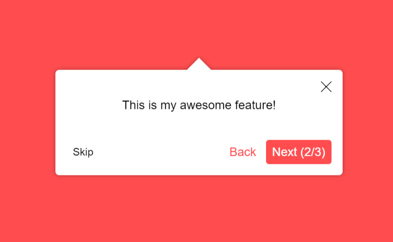
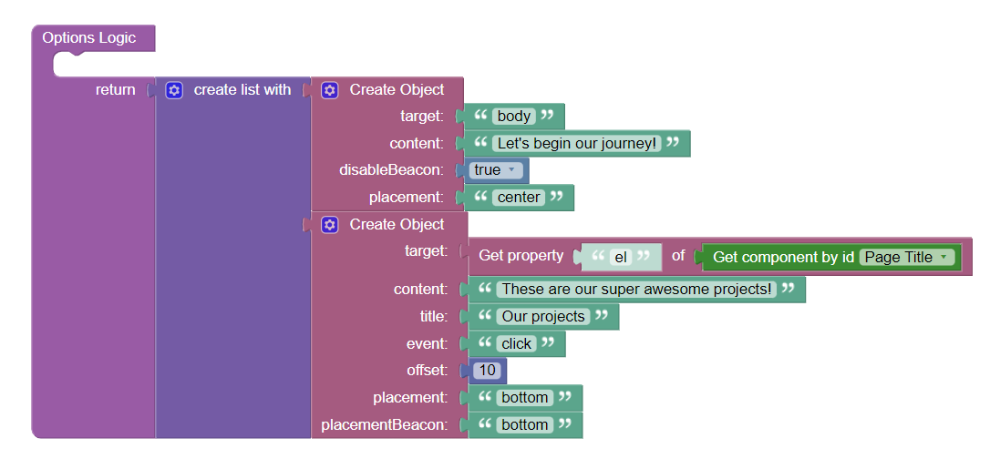

# Tour Guide

Tour Guide is the component for Backendless [UI-Builder](https://backendless.com/developers/#ui-builder), based on the
[React Joyride](https://github.com/gilbarbara/react-joyride) library. It provides a way to create a sequence of steps
that guide users through the features and functionality of an application.

<p align="center">
  
</p>

## Properties

| Property                | Type       | Default value                                                                                                       | Logic               | Data Binding | UI Setting | Description                                                                                                                                |
|-------------------------|------------|---------------------------------------------------------------------------------------------------------------------|---------------------|--------------|------------|--------------------------------------------------------------------------------------------------------------------------------------------|
| Options                 | *JSON*     | `[{ "content": "These are our super awesome projects!", "target": "body", "placement": "center" }]`                 | Options Logic       | NO           | YES        | Specifies an array of the steps. Signature of Step: `{target: Element \| String, content: String}`. Watch [Configuration](#configuration). |
| Continuous              | *Checkbox* | `true`                                                                                                              |                     | NO           | YES        | Enables playing the tour sequentially with the Next button.                                                                                |
| Auto Start              | *Checkbox* | `false`                                                                                                             |                     | NO           | YES        | Enables start playing the tour automatically. Use the `disableBeacon` prop on the first Step to run without showing a beacon.              |
| Control Visibility      | *Checkbox* | `true`                                                                                                              |                     | NO           | YES        | Enables showing the Start Tour button.                                                                                                     |
| Control Label           | *String*   | "Start"                                                                                                             | Control Label Logic | NO           | YES        | Controls the label of the Start Tour button.                                                                                               |
| Overlay Visibility      | *Checkbox* | `true`                                                                                                              |                     | NO           | YES        | Enables showing an overlay with holes above your steps.                                                                                    |
| Close On Click Overlay  | *Checkbox* | `true`                                                                                                              |                     | NO           | YES        | Enables closing the tooltip when the overlay is clicked.                                                                                   |
| Close On Escape         | *Checkbox* | `true`                                                                                                              |                     | NO           | YES        | Enables closing the tooltip by pressing the Escape button.                                                                                 |
| Scrolling               | *Checkbox* | `true`                                                                                                              |                     | NO           | YES        | Enables auto scrolling between steps.                                                                                                      |
| Labels                  | *JSON*     | `{ "back": "Back", "close": "Close", "last": "Finish", "next": "Next", "open": "Open the dialog", "skip": "Skip" }` | Labels Logic        | NO           | YES        | Specifies the strings used in the tooltip.                                                                                                 |
| Back Button Visibility  | *Checkbox* | `true`                                                                                                              |                     | NO           | YES        | Enables showing the Back button.                                                                                                           |
| Close Button Visibility | *Checkbox* | `true`                                                                                                              |                     | NO           | YES        | Enables showing the Close button.                                                                                                          |
| Skip Button Visibility  | *Checkbox* | `true`                                                                                                              |                     | NO           | YES        | Enables showing the Skip button.                                                                                                           |
| Progress Visibility     | *Checkbox* | `true`                                                                                                              |                     | NO           | YES        | Enables showing the tour progress on the Next button in continuous tours.                                                                  |
| Scroll Offset           | *Number*   | 20                                                                                                                  |                     | NO           | YES        | Controls the scroll distance from the element scrollTop value.                                                                             |
| Scroll Duration         | *Number*   | 300                                                                                                                 |                     | NO           | YES        | Controls the duration of the scroll to the element.                                                                                        |
| Scroll To First Step    | *Checkbox* | `true`                                                                                                              |                     | NO           | YES        | Enables page scrolling for the first step.                                                                                                 |
| Spotlight Clicks        | *Checkbox* | `false`                                                                                                             |                     | NO           | YES        | Allow mouse and touch events thru the spotlight.                                                                                           |
| Spotlight Padding       | *Number*   | 10                                                                                                                  |                     | NO           | YES        | Controls the padding of the spotlight.                                                                                                     |
| Beacon Size             | *Number*   | 36                                                                                                                  |                     | NO           | YES        | Controls the size of the beacon.                                                                                                           |
| Width                   | *Number*   | 380                                                                                                                 |                     | NO           | YES        | Controls the width of the tooltip.                                                                                                         |
| Primary Color           | *Color*    | "#FF0044"                                                                                                           |                     | NO           | YES        | Controls the theme color of the tour guide.                                                                                                |
| Text Color              | *Color*    | "#000000"                                                                                                           |                     | NO           | YES        | Controls the text color of the tour guide.                                                                                                 |
| Background Color        | *Color*    | "#FFFFFF"                                                                                                           |                     | NO           | YES        | Controls the background color of the tour guide.                                                                                           |
| Arrow Color             | *Color*    | "#FFFFFF"                                                                                                           |                     | NO           | YES        | Controls the color of the tooltip arrow.                                                                                                   |
| Overlay Color           | *Color*    | "rgba(0, 0, 0, 0.5)"                                                                                                |                     | NO           | YES        | Controls the overlay color of the tour guide.                                                                                              |

## Events

| Name             | Triggers                    | Context Blocks       |
|------------------|-----------------------------|----------------------|
| On Change Event  | when the tour state changes | Tour State: `Object` |

## Actions

| Action                            | Inputs | Returns |
|-----------------------------------|--------|---------|
| Start Tour Guide                  |        |         |
| Stop Tour Guide                   |        |         |
| Go to Next Step of Tour Guide     |        |         |
| Go to Previous Step of Tour Guide |        |         |
| Go to Step of Tour Guide          |        |         |
| Close Current Step of Tour Guide  |        |         |
| Open Current Step of Tour Guide   |        |         |
| Reset Tour Guide                  |        |         |

## Styles

**Theme**

````
@bl-customComponent-tourGuide-themeColor: @themePrimary;
@bl-customComponent-tourGuide-backgroundColor: @appBackgroundColor;
@bl-customComponent-tourGuide-shadowColor: @appComponentShadowColor;
@bl-customComponent-tourGuide-borderRadius: @appComponentBorderRadius;
````

**General**

````
@bl-customComponent-tourGuide-button-backgroundColor: @bl-customComponent-tourGuide-themeColor;
@bl-customComponent-tourGuide-button-color: contrast(@bl-customComponent-tourGuide-button-backgroundColor);
@bl-customComponent-tourGuide-button-userSelect: none;
@bl-customComponent-tourGuide-button-cursor: pointer;
@bl-customComponent-tourGuide-floater-position: fixed!important;
````

**Dimensions**

````
@bl-customComponent-tourGuide-button-width: 100%;
@bl-customComponent-tourGuide-button-minWidth: 64px;
@bl-customComponent-tourGuide-button-margin: 20px 10px;
@bl-customComponent-tourGuide-button-padding: 6px 16px;
````

**Typography**

````
@bl-customComponent-tourGuide-button-lineHeight: 1.75;
@bl-customComponent-tourGuide-button-fontSize: 14px;
@bl-customComponent-tourGuide-button-textDecoration: none;
````

**Decoration**

````
@bl-customComponent-tourGuide-button-borderWidth: 0;
@bl-customComponent-tourGuide-button-borderRadius: @bl-customComponent-tourGuide-borderRadius;
@bl-customComponent-tourGuide-button-shadowColor: @bl-customComponent-tourGuide-shadowColor;
@bl-customComponent-tourGuide-button-shadowHover: 0px 2px 4px -1px fade(@bl-customComponent-tourGuide-button-shadowColor, 20%), 0px 4px 5px 0px fade(@bl-customComponent-tourGuide-button-shadowColor, 14%), 0px 1px 10px 0px fade(@bl-customComponent-tourGuide-button-shadowColor, 12%);
@bl-customComponent-tourGuide-button-outline: none;
````

## Configuration

The Step is a plain object that only requires two properties to be valid: `target` and `content`.
Below is the complete list of possible props of the Step:

| Property        | Type                | Default value | Description                                                                                                                                                                                                                                                                       |
|-----------------|---------------------|---------------|-----------------------------------------------------------------------------------------------------------------------------------------------------------------------------------------------------------------------------------------------------------------------------------|
| content         | *String*            |               | The tooltip's body.                                                                                                                                                                                                                                                               |
| target          | *Element \| String* |               | The target for the step. It can be a CSS selector or an HTMLElement directly. Required property.                                                                                                                                                                                  |
| placement       | *String*            | "bottom"      | The placement of the beacon and tooltip. It will re-position itself if there's no space available. It can be: `top` (`top-start`, `top-end`), `bottom` (`bottom-start`, `bottom-end`), `left` (`left-start`, `left-end`), `right` (`right-start`, `right-end`), `auto`, `center`. |
| disableBeacon   | *Boolean*           | `false`       | Don't show the beacon before the tooltip.                                                                                                                                                                                                                                         |
| event           | *String*            | "click"       | The event to trigger the beacon. It can be `click` or `hover`.                                                                                                                                                                                                                    |
| offset          | *Number*            | 10            | The distance from the target to the tooltip.                                                                                                                                                                                                                                      |
| placementBeacon | *String*            |               | The placement of the beacon. It will use the `placement` if nothing is passed and it can be: `top`, `bottom`, `left`, `right`.                                                                                                                                                    |
| styles          | *Object*            |               | Override the styling of the step's Tooltip.                                                                                                                                                                                                                                       |
| title           | *String*            |               | The tooltip's title.                                                                                                                                                                                                                                                              |

Adding options to the component:



<details>
<summary>Try yourself</summary>

```
<block xmlns="http://www.w3.org/1999/xhtml" type="lists_create_with" id="PS04*4/U@e^LUpI5FmYM" x="178.65908813476562" y="118"><mutation items="2"></mutation><value name="ADD0"><block type="create_object" id="95F[-B[|M}@UtP,ma,%Z"><mutation><properties><item id="property" prop-name="target"></item><item id="property" prop-name="content"></item><item id="property" prop-name="disableBeacon"></item><item id="property" prop-name="placement"></item></properties></mutation><value name="create_object_mutator_container_properties_stack_property0"><block type="text" id="#9{xas@p`;.XSY2nz:/Y"><field name="TEXT">body</field></block></value><value name="create_object_mutator_container_properties_stack_property1"><block type="text" id="J:H6TE8bK;v!h?pr+Qd;"><field name="TEXT">Let's begin our journey!</field></block></value><value name="create_object_mutator_container_properties_stack_property2"><block type="logic_boolean" id="hYe;^Uc9XOEck7+SV_V}"><field name="BOOL">TRUE</field></block></value><value name="create_object_mutator_container_properties_stack_property3"><block type="text" id="pOm^d/M3G)%y?ncN!RK,"><field name="TEXT">center</field></block></value></block></value><value name="ADD1"><block type="create_object" id="guTD)Q50%tfruqg~/f~M"><mutation><properties><item id="property" prop-name="target"></item><item id="property" prop-name="content"></item><item id="property" prop-name="title"></item><item id="property" prop-name="event"></item><item id="property" prop-name="offset"></item><item id="property" prop-name="placement"></item><item id="property" prop-name="placementBeacon"></item></properties></mutation><value name="create_object_mutator_container_properties_stack_property0"><block type="get_object_property" id="1^/f=y#SPASDBeufmOyx"><value name="prop_name"><shadow type="text" id="p^tg[GTqnVl,GpaE0CaK"><field name="TEXT">el</field></shadow></value><value name="object"><block type="ui_common_blocks__get_component_by_id" id="laarK=XC8q,%wiqRlVq=" bl_meta="{&quot;label&quot;:&quot;Get component by id&quot;}"><field name="componentUid">'00b276c2b0c5baaa9282670dd683dc65'</field></block></value></block></value><value name="create_object_mutator_container_properties_stack_property1"><block type="text" id="E3w+Jj#Y5G:dc+.)*3?,"><field name="TEXT">These are our super awesome projects!</field></block></value><value name="create_object_mutator_container_properties_stack_property2"><block type="text" id="VF2:uNo,vg6jlj)$*rbd"><field name="TEXT">Our projects</field></block></value><value name="create_object_mutator_container_properties_stack_property3"><block type="text" id="z!3Z|lYJA|A]CjqPnZgs"><field name="TEXT">click</field></block></value><value name="create_object_mutator_container_properties_stack_property4"><block type="math_number" id="nq4bdVcaZa2Sv$]zU~,O"><field name="NUM">10</field></block></value><value name="create_object_mutator_container_properties_stack_property5"><block type="text" id="gzyU%:@x,}%S7m!Hp3E$"><field name="TEXT">bottom</field></block></value><value name="create_object_mutator_container_properties_stack_property6"><block type="text" id="$qX1xxi5c?5XD9TAw%BJ"><field name="TEXT">bottom</field></block></value></block></value></block>
```
</details>
