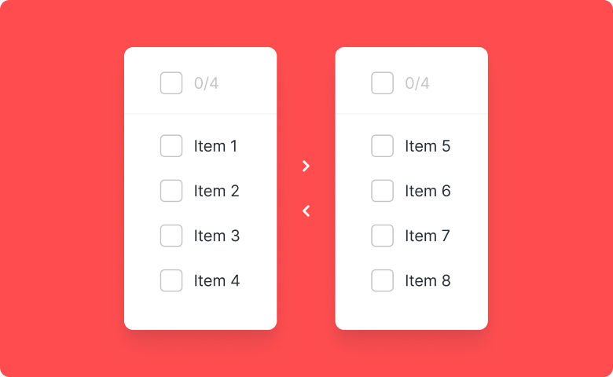
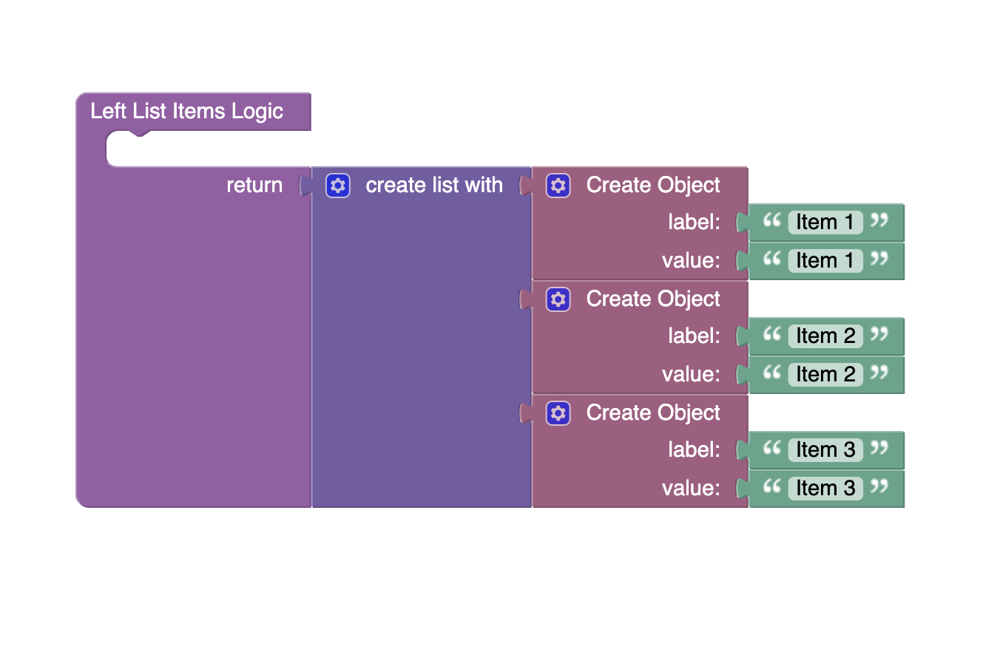

# Transfer list

Transfer list is a component of Backendless UI-Builder designer. It allows you to move one or more list items between lists.

<p align="center">
  
</p>

## Demo

View an example of how to install this component and how it works in your UI [here](https://app.arcade.software/share/R7bYZty8pOwSAa4TRiNP).

## Properties

| Property         | Type                                 | Default value | Logic                  | Data Binding | UI Setting | Description                                                                   |
|------------------|--------------------------------------|---------------|------------------------|--------------|------------|-------------------------------------------------------------------------------|
| Disabled         | *Checkbox*                           | `false`       | Disabled Logic         | YES          | YES        | This handler allows you to disable a component.                               |
| List Type        | *Select* <br/> "basic" \| "enhanced" | 'basic'       | List Type Logic        | YES          | YES        | This handler allows you to select a list with or without a title.             |
| Left List Title  | *Text*                               | 'Choices'     | List Type Logic        | YES          | YES        | This handler allows you to specify the title of the list to the left.         |
| Right List Title | *Text*                               | 'Chosen'      | List Type Logic        | YES          | YES        | This handler allows you to specify the title of the list to the right.        |
| Left List Items  | *JSON*                               |               | Left List Items Logic  | YES          | YES        | This handler allows you to add items to display in the left list. Watch [Codeless Examples](#Examples). Signature of item: `{value: String, label: String}`. |
| Right List Items | *JSON*                               |               | Right List Items Logic | YES          | YES        | This handler allows you to add items to display in the right list. Watch [Codeless Examples](#Examples) Signature of item: `{value: String, label: String}`.  |

## Events

| Name             | Triggers                                 | Context Blocks                             |
|------------------|------------------------------------------|--------------------------------------------|
| On Change Event  | when user clicks on the transfer button  | Left Items: `Array`, Right Items: `Array`  |

## Styles

**Theme**
````
@bl-customComponent-transferList-themeColor: @themePrimary;
@bl-customComponent-transferList-backgroundColor: @appBackgroundColor;
@bl-customComponent-transferList-textColor: @appTextColor;
````

**Dimensions**
````
@bl-customComponent-transferList-width: 200px;
@bl-customComponent-transferList-height: 230px;
````

## <a name="Examples"></a> Codeless Examples

Adding of items to list:


