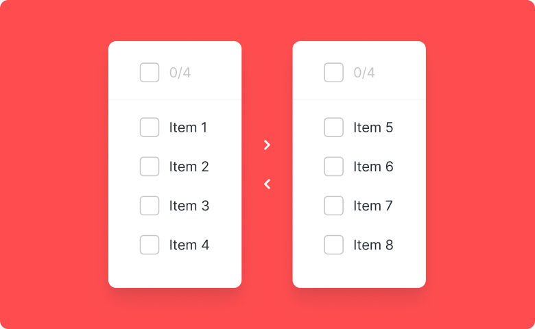
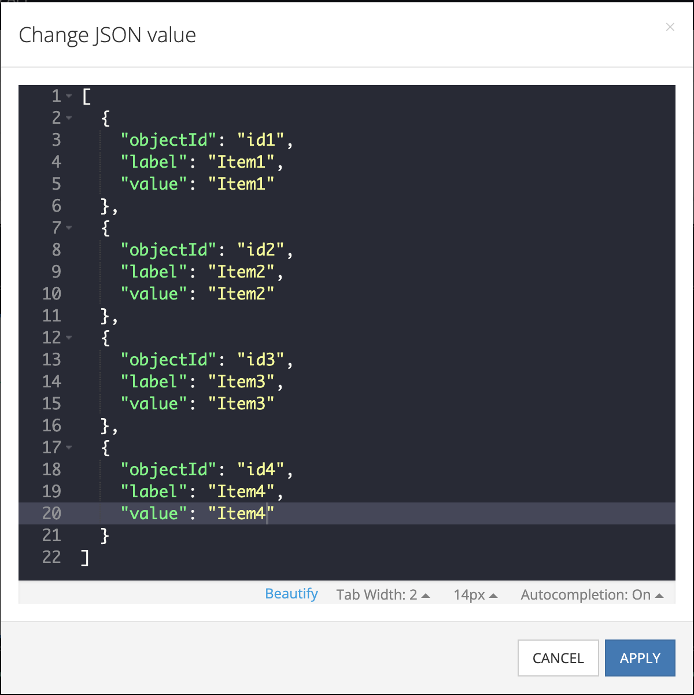

# Transfer list

Transfer list is a component of Backendless UI-Builder designer. It allows you to move one or more list items between lists.

<p align="center">
  
</p>

## Properties

| Property    | Type                                 | Default value | Logic             | Data Binding | UI Setting | Description                                                        |
|-------------|--------------------------------------|---------------|-------------------|--------------|------------|--------------------------------------------------------------------|
| Disabled    | *Checkbox*                           | `false`       | Disabled Logic    | YES          | YES        | This handler allows you to disable a component.                    |
| List Type   | *Select* <br/> "basic" \| "enhanced" | 'basic'       | List Type Logic   | YES          | YES        | This handler allows you to select a list with or without a title.  |
| Left Items  | *JSON*                               |               | Left Items Logic  | YES          | YES        | This handler allows you to add items to display in the left list. Watch [Codeless Examples](#Examples)  |
| Right Items | *JSON*                               |               | Right Items Logic | YES          | YES        | This handler allows you to add items to display in the right list. Watch [Codeless Examples](#Examples) |

## Events

| Name             | Triggers                                 | Context Blocks                             |
|------------------|------------------------------------------|--------------------------------------------|
| On Change Event  | when user clicks on the transfer button  | Left Items: `Array`, Right Items: `Array`  |

## Styles

**Theme**
````
@bl-customComponent-transferList-themeColor: @themePrimary;
@bl-customComponent-transferList-backgroundColor: @appBackgroundColor;
@bl-customComponent-transferList-textColor: @appTextColor;
````

## <a name="Examples"></a> Codeless Examples

Adding of items to list:


