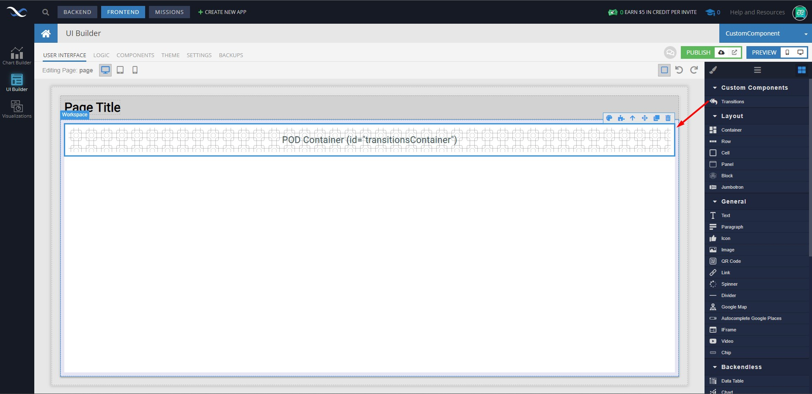
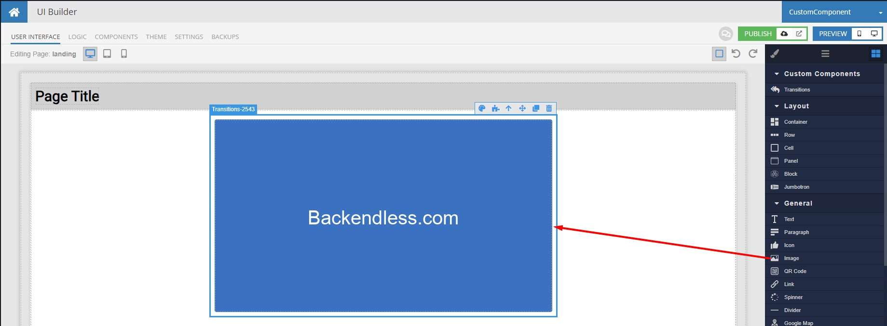
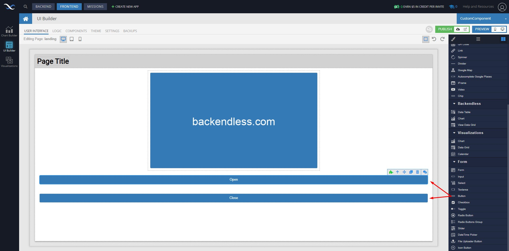
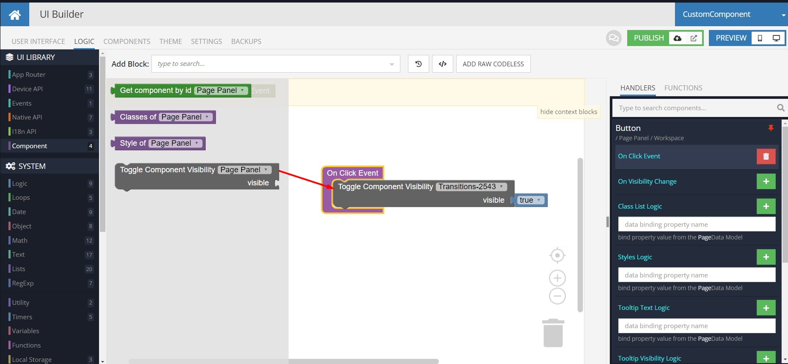
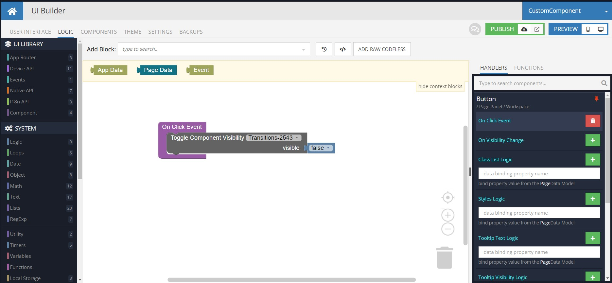
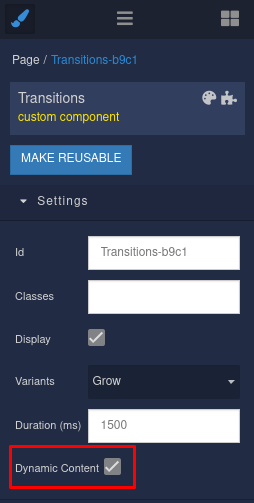
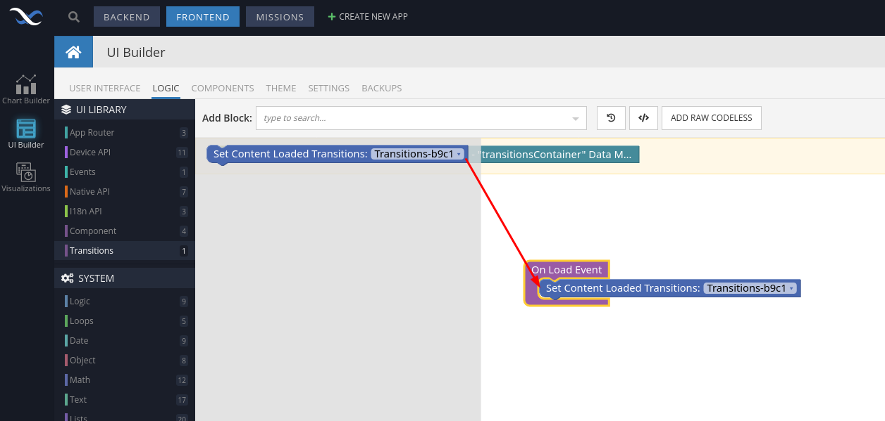

# Transitions

Transitions is a component of the Backendless [UI-Builder](https://backendless.com/developers/#ui-builder). This component allows you to add a smooth component mounting animation.

The component based on external [Transitions](https://mui.com/material-ui/transitions/).

## Properties

| Property | Type                                                                  | Default Value  | Logic | Data Binding | UI Setting | Description                                     |
|----------|-----------------------------------------------------------------------|----------------|-------|--------------|------------|-------------------------------------------------|
| Variants | Select  ["collapse-top", "collapse-left", "fade", "grow", "zoom"] | "collapse-top" |       | NO           | YES        | Allows to determine variant of transition       |
| Duration | Number                                                                | 300            |       | NO           | YES        | Allows to determine duration of transition (ms) |

## Events

| Name             | Triggers                                                | Context Blocks |
|------------------|---------------------------------------------------------|----------------|
| On Mounted       | after the component is mounted and appeared on the page |                |
| On Unmounted     | before the component is unmounted and destroyed         |                |
| On End Animation | after the animation finishes                            |                |

## Usage Guide

### Adding the Transitions component to the page:

### Adding component in the transitions pod:
> 🔴 **IMPORTANT**: If you add any Image component, set its width and height. This is generally good practice for all images on a website

Now you can open the preview and see the mount animation when the page loads.

---

### Changing the visibility of the component Transitions

You can also change the visibility of the component "Transitions" and see the animation for mounting and unmounting.

For example:

1. Add two buttons to the page: the first button is "Open" and the second button is "Close":

2. Open button logic:

3. Close button logic:

In the preview, you now have the option to change the visibility of the component with animation by clicking on either the Close or Open button.

### Adding component with dynamic content in transition
If you want to animate content that is rendered with a delay (for example, asynchronously loaded) follow the guide:

1. You need to activate it in the settings:

> 🔴 **IMPORTANT**: After this action the component will not be displayed in preview mode

2. Run the action `Set Content Loaded` when your components are fully rendered. It could be done in `On ... Mount` handlers.

