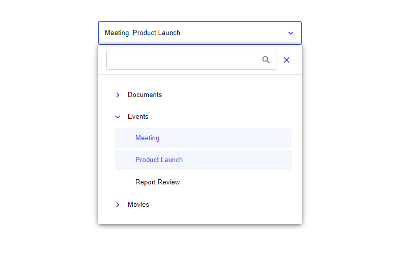
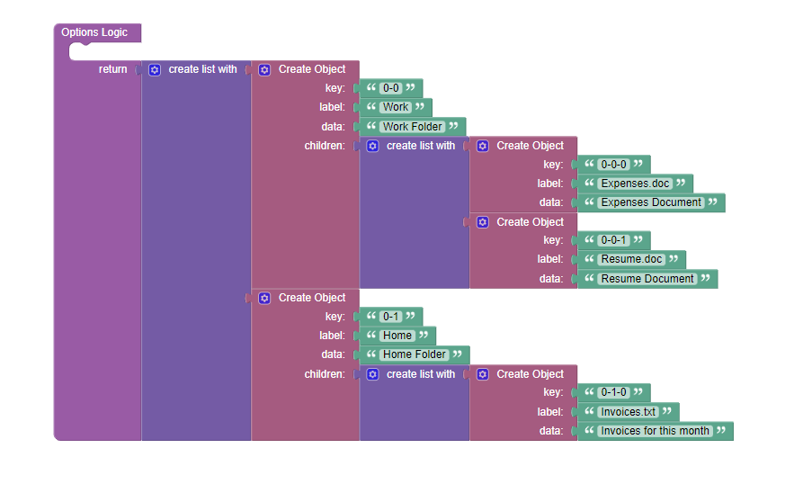

# TreeSelect

TreeSelect is a component for Backendless [UI-Builder](https://backendless.com/developers/#ui-builder) based on the [PrimeReact](https://www.primefaces.org/primereact/treeselect/) library. It is used to generate select input fields and allows users to choose from hierarchical data.

<p align="center">
  
</p>

## Properties

| Property                | Type                                                | Default value                                                                                                                                                                           | Logic                        | Data Binding | UI Setting | Description                                                                                                                                                                                |
|-------------------------|-----------------------------------------------------|-----------------------------------------------------------------------------------------------------------------------------------------------------------------------------------------|------------------------------|--------------|------------|--------------------------------------------------------------------------------------------------------------------------------------------------------------------------------------------|
| Label                   | *Text*                                              | "Select Items"                                                                                                                                                                          | Label Logic                  | NO           | YES        | Controls the hint text for the input field.                                                                                                                                                |
| Options                 | *JSON*                                              | `[{"key": "0", "label": "Documents", "data": "Documents Folder"}, {"key": "1", "label": "Events", "data": "Events Folder"}, {"key": "2", "label": "Movies", "data": "Movies Folder"}] ` | Options Logic                | NO           | YES        | Specifies an array of options to display. Signature of Option: `{key: String, label: String, data: Any, children: [ Option ]}`. Watch [Codeless Examples](#codeless-examples).             |
| Selected Option Key(s)  | *Text*                                              |                                                                                                                                                                                         | Selected Option Key(s) Logic | NO           | YES        | Controls the selection state of the component. If there are several keys, they should be separated by commas.                                                                              |
| Selection Mode          | *Select* <br/> "Single" \| "Multiple" \| "Checkbox" | "Single"                                                                                                                                                                                |                              | NO           | YES        | Controls the selection mode of the options.                                                                                                                                                |
| Chips Visibility        | *Checkbox*                                          | `false`                                                                                                                                                                                 |                              | NO           | YES        | Enables showing selected items as tokens.                                                                                                                                                  |
| Disabled                | *Checkbox*                                          | `false`                                                                                                                                                                                 | Disabled State Logic         | NO           | YES        | Specifies that the component should be disabled.                                                                                                                                           |
| Filter Visibility       | *Checkbox*                                          | `true`                                                                                                                                                                                  |                              | NO           | YES        | Enables showing an input field to filter the items.                                                                                                                                        |
| Reset Filter On Hide    | *Checkbox*                                          | `false`                                                                                                                                                                                 |                              | NO           | YES        | Enables clearing the filter value when hiding the dropdown list.                                                                                                                           |
| Filter Input Auto Focus | *Checkbox*                                          | `true`                                                                                                                                                                                  |                              | NO           | YES        | Enables focusing the filter input automatically when the dropdown list is opened.                                                                                                          |
| Filter Placeholder      | *Text*                                              |                                                                                                                                                                                         |                              | NO           | YES        | Controls placeholder text to show when filter input is empty.                                                                                                                              |
| Options Panel Height    | *Text*                                              | "400px"                                                                                                                                                                                 |                              | NO           | YES        | Controls maximum height of the options panel.                                                                                                                                              |
| Meta Key Selection      | *Checkbox*                                          | `false`                                                                                                                                                                                 |                              | NO           | YES        | Enables pressing meta-keys to select or unselect an item for multiple selection. This is the Command key on a Macintosh keyboard and the Windows/Control keys on a Windows/Linux keyboard. |
| Empty Message           | *Text*                                              | "No results found"                                                                                                                                                                      |                              | NO           | YES        | Controls text to display when there is no options.                                                                                                                                         |

## Events

| Name              | Triggers                             | Context Blocks                      |
|-------------------|--------------------------------------|-------------------------------------|
| On Show Event     | when the overlay is shown            |                                     |
| On Hide Event     | when the overlay is hidden           |                                     |
| On Change Event   | when the user changes selected items | Changed Value: `String` \| `Object` |
| On Select Event   | when the user selects the item       | Selected Item: `Object`             |
| On Unselect Event | when the user deselects the item     | Unselected Item: `Object`           |
| On Expand Event   | when the user expands the item       | Expanded Item: `Object`             |
| On Collapse Event | when the user collapses the item     | Collapsed Item: `Object`            |

## Actions

| Action                              | Inputs | Returns |
|-------------------------------------|--------|---------|
| Expand All Options for TreeSelect   |        |         |
| Collapse All Options for TreeSelect |        |         |

## Styles

**Theme**

````
@bl-customComponent-treeSelect-themeColor: @themePrimary;
@bl-customComponent-treeSelect-backgroundColor: @appBackgroundColor;
@bl-customComponent-treeSelect-textColor: @appTextColor;
@bl-customComponent-treeSelect-disabledColor: @disabledColor;
@bl-customComponent-treeSelect-shadowColor: @appComponentShadowColor;
@bl-customComponent-treeSelect-borderRadius: @appComponentBorderRadius;
@bl-customComponent-treeSelect-borderWidth: @appComponentBorderWidth;
````

**General**

````
@bl-customComponent-treeSelect-color: @bl-customComponent-treeSelect-textColor;
@bl-customComponent-treeSelect-tree-background: @bl-customComponent-treeSelect-backgroundColor;
@bl-customComponent-treeSelect-tree-color: @bl-customComponent-treeSelect-color;
@bl-customComponent-treeSelect-tree-toggler-background: transparent;
@bl-customComponent-treeSelect-icon-color: @bl-customComponent-treeSelect-themeColor;
@bl-customComponent-treeSelect-options-color: @bl-customComponent-treeSelect-tree-color;
@bl-customComponent-treeSelect-options-background: @bl-customComponent-treeSelect-tree-background;
@bl-customComponent-treeSelect-header-background: @bl-customComponent-treeSelect-tree-background;
@bl-customComponent-treeSelect-filter-icon-color: fade(@bl-customComponent-treeSelect-color, 60%);
@bl-customComponent-treeSelect-close-icon-background: transparent;
@bl-customComponent-treeSelect-close-icon-hover-background: fade(@bl-customComponent-treeSelect-themeColor, 10%);
@bl-customComponent-treeSelect-checkbox-icon-color: @bl-customComponent-treeSelect-color;
@bl-customComponent-treeSelect-checkbox-background: @bl-customComponent-treeSelect-backgroundColor;
@bl-customComponent-treeSelect-checkbox-highlight-background: @bl-customComponent-treeSelect-themeColor;
@bl-customComponent-treeSelect-emptyMessage-color: fade(@bl-customComponent-treeSelect-textColor, 80%);
@bl-customComponent-treeSelect-emptyMessage-background: transparent;
@bl-customComponent-treeSelect-input-color: @bl-customComponent-treeSelect-textColor;
@bl-customComponent-treeSelect-input-background: transparent;
@bl-customComponent-treeSelect-toggler-hover-background: fade(@bl-customComponent-treeSelect-themeColor, 10%);
@bl-customComponent-treeSelect-trigger-background: transparent;
@bl-customComponent-treeSelect-content-highlight-color: @bl-customComponent-treeSelect-themeColor;
@bl-customComponent-treeSelect-content-highlight-background: fade(@bl-customComponent-treeSelect-themeColor, 5%);
@bl-customComponent-treeSelect-content-hover-color: @bl-customComponent-treeSelect-textColor;
@bl-customComponent-treeSelect-content-hover-background: @bl-customComponent-treeSelect-content-highlight-background;
@bl-customComponent-treeSelect-chip-token-background: #dee2e6;
@bl-customComponent-treeSelect-chip-token-color: #495057;
````

**Dimensions**

````
@bl-customComponent-treeSelect-tree-padding: 20px;
@bl-customComponent-treeSelect-tree-toggler-marginRight: 8px;
@bl-customComponent-treeSelect-tree-toggler-width: 32px;
@bl-customComponent-treeSelect-tree-toggler-height: 32px;
@bl-customComponent-treeSelect-tree-treenode-padding: 2px;
@bl-customComponent-treeSelect-tree-treenodeChildren-paddingLeft: 16px;
@bl-customComponent-treeSelect-tree-treenodeContent-padding: 8px;
@bl-customComponent-treeSelect-icon-search-marginTop: -12px;
@bl-customComponent-treeSelect-header-padding: 12px 20px;
@bl-customComponent-treeSelect-header-margin: 0;
@bl-customComponent-treeSelect-filter-marginRight: 8px;
@bl-customComponent-treeSelect-filter-paddingRight: 38px;
@bl-customComponent-treeSelect-filter-icon-position-right: 12px;
@bl-customComponent-treeSelect-close-icon-width: 32px;
@bl-customComponent-treeSelect-close-icon-height: 32px;
@bl-customComponent-treeSelect-checkbox-width: 20px;
@bl-customComponent-treeSelect-checkbox-height: 20px;
@bl-customComponent-treeSelect-checkbox-marginRight: 8px;
@bl-customComponent-treeSelect-emptyMessage-padding: 12px 20px;
@bl-customComponent-treeSelect-input-padding: 12px;
@bl-customComponent-treeSelect-label-padding: 17px 14px;
@bl-customComponent-treeSelect-trigger-width: 48px;
@bl-customComponent-treeSelect-trigger-minHeight: 53px;
@bl-customComponent-treeSelect-chip-label-padding: 11px 14px;
@bl-customComponent-treeSelect-chip-token-padding: 6px 12px;
@bl-customComponent-treeSelect-chip-token-marginRight: 8px;
````

**Typography**

````
@bl-customComponent-treeSelect-fontSize: inherit;
@bl-customComponent-treeSelect-icon-fontSize: 24px;
@bl-customComponent-treeSelect-icon-fontFamily: 'Material Icons Round';
@bl-customComponent-treeSelect-checkbox-fontSize: 14px;
@bl-customComponent-treeSelect-input-fontFamily: -apple-system, BlinkMacSystemFont, "Segoe UI", Roboto, Helvetica, Arial, sans-serif, "Apple Color Emoji", "Segoe UI Emoji", "Segoe UI Symbol";
@bl-customComponent-treeSelect-input-fontSize: 16px;
````

**Decoration**

````
@bl-customComponent-treeSelect-borderType: solid;
@bl-customComponent-treeSelect-borderColor: @bl-customComponent-treeSelect-themeColor;
@bl-customComponent-treeSelect-border: @bl-customComponent-treeSelect-borderWidth @bl-customComponent-treeSelect-borderType @bl-customComponent-treeSelect-borderColor;
@bl-customComponent-treeSelect-tree-border: 0 none;
@bl-customComponent-treeSelect-tree-toggler-border: 0 none;
@bl-customComponent-treeSelect-tree-toggler-borderRadius: 50%;
@bl-customComponent-treeSelect-tree-toggler-transition: background-color 0.2s;
@bl-customComponent-treeSelect-options-boxShadow: 0 2px 12px 0 fade(@bl-customComponent-treeSelect-shadowColor, 60%);
@bl-customComponent-treeSelect-header-borderBottom: 1px solid fade(@bl-customComponent-treeSelect-tree-color, 80%);
@bl-customComponent-treeSelect-close-icon-borderRadius: 50%;
@bl-customComponent-treeSelect-close-icon-transition: background-color 0.2s;
@bl-customComponent-treeSelect-close-icon-border: 0 none;
@bl-customComponent-treeSelect-checkbox-highlight-borderColor: @bl-customComponent-treeSelect-checkbox-highlight-background;
@bl-customComponent-treeSelect-checkbox-hover-borderColor: @bl-customComponent-treeSelect-checkbox-highlight-borderColor;
@bl-customComponent-treeSelect-checkbox-borderRadius: 4px;
@bl-customComponent-treeSelect-checkbox-border: 2px solid fade(@bl-customComponent-treeSelect-color, 30%);
@bl-customComponent-treeSelect-checkbox-transition: background-color 0.2s, border-color 0.2s;
@bl-customComponent-treeSelect-checkbox-transitionDuration: 0.2s;
@bl-customComponent-treeSelect-input-hover-borderColor: @bl-customComponent-treeSelect-borderColor;
@bl-customComponent-treeSelect-input-hover-boxShadow: 0 0 0 0.1rem fade(@bl-customComponent-treeSelect-themeColor, 60%);
@bl-customComponent-treeSelect-input-border: 1px solid fade(@bl-customComponent-treeSelect-color, 20%);
@bl-customComponent-treeSelect-input-transition: border-color 0.2s, box-shadow 0.2s;
@bl-customComponent-treeSelect-chip-token-borderRadius: 16px;
````

## Codeless Examples

Below is a Codeless Example highlighting how to add options to the component:



<details>
<summary>Try yourself</summary>

```
<block xmlns="http://www.w3.org/1999/xhtml" type="lists_create_with" id="Qgg;VXbp%lPHv.J:ZcWm" x="248.6750030517578" y="180"><mutation items="2"></mutation><value name="ADD0"><block type="create_object" id="3g-:=GAj5!Nog[21Gn5n"><mutation><properties><item id="property" prop-name="key"></item><item id="property" prop-name="label"></item><item id="property" prop-name="data"></item><item id="property" prop-name="children"></item></properties></mutation><value name="create_object_mutator_container_properties_stack_property0"><block type="text" id="~.Y*,5.CS8?0RNu$0KoE"><field name="TEXT">0-0</field></block></value><value name="create_object_mutator_container_properties_stack_property1"><block type="text" id="s.z|rzTGk,y_Aa,?U0hQ"><field name="TEXT">Work</field></block></value><value name="create_object_mutator_container_properties_stack_property2"><block type="text" id="(tZ;kSLRU=7e4trZ2-~i"><field name="TEXT">Work Folder</field></block></value><value name="create_object_mutator_container_properties_stack_property3"><block type="lists_create_with" id="lP1o)MxojisO9#c85E(R"><mutation items="2"></mutation><value name="ADD0"><block type="create_object" id=")@0iP~!Ai;#tOH)up2x4"><mutation><properties><item id="property" prop-name="key"></item><item id="property" prop-name="label"></item><item id="property" prop-name="data"></item></properties></mutation><value name="create_object_mutator_container_properties_stack_property0"><block type="text" id="pWA!Xb^}6Cc[IhDDhRQz"><field name="TEXT">0-0-0</field></block></value><value name="create_object_mutator_container_properties_stack_property1"><block type="text" id="T-yO8}OG75p-?)LTf,%#"><field name="TEXT">Expenses.doc</field></block></value><value name="create_object_mutator_container_properties_stack_property2"><block type="text" id="B6K3fBGu$Ir|M}rFG-8X"><field name="TEXT">Expenses Document</field></block></value></block></value><value name="ADD1"><block type="create_object" id="neVL.QoGaEe)ELR-PK*a"><mutation><properties><item id="property" prop-name="key"></item><item id="property" prop-name="label"></item><item id="property" prop-name="data"></item></properties></mutation><value name="create_object_mutator_container_properties_stack_property0"><block type="text" id="/Q8?yr2bpVHq|bi;!L#c"><field name="TEXT">0-0-1</field></block></value><value name="create_object_mutator_container_properties_stack_property1"><block type="text" id="=R58N:vk1IhEjxB:5.$#"><field name="TEXT">Resume.doc</field></block></value><value name="create_object_mutator_container_properties_stack_property2"><block type="text" id="`^6WF#2r*1;=4t%K3oy8"><field name="TEXT">Resume Document</field></block></value></block></value></block></value></block></value><value name="ADD1"><block type="create_object" id="}$Yu)ZQqzO|j=5jo8n2k"><mutation><properties><item id="property" prop-name="key"></item><item id="property" prop-name="label"></item><item id="property" prop-name="data"></item><item id="property" prop-name="children"></item></properties></mutation><value name="create_object_mutator_container_properties_stack_property0"><block type="text" id="~XbRwY*e=97(,DOFXS_c"><field name="TEXT">0-1</field></block></value><value name="create_object_mutator_container_properties_stack_property1"><block type="text" id="LhY{sP{.uau6o7@H_4Lc"><field name="TEXT">Home</field></block></value><value name="create_object_mutator_container_properties_stack_property2"><block type="text" id="8t)9~Mey{3.T=-CIKDZ-"><field name="TEXT">Home Folder</field></block></value><value name="create_object_mutator_container_properties_stack_property3"><block type="lists_create_with" id="~HIuoJ9@R3M)$x_(,,@V"><mutation items="1"></mutation><value name="ADD0"><block type="create_object" id="5U-Be$hYn|^*3=iHRG7R"><mutation><properties><item id="property" prop-name="key"></item><item id="property" prop-name="label"></item><item id="property" prop-name="data"></item></properties></mutation><value name="create_object_mutator_container_properties_stack_property0"><block type="text" id="QXn)(4m1L.8~Md!3n4Xs"><field name="TEXT">0-1-0</field></block></value><value name="create_object_mutator_container_properties_stack_property1"><block type="text" id="D2Ts1g^v+)v)+nXYJF~h"><field name="TEXT">Invoices.txt</field></block></value><value name="create_object_mutator_container_properties_stack_property2"><block type="text" id="W@H4z%GZb~-=Z,k84g;]"><field name="TEXT">Invoices for this month</field></block></value></block></value></block></value></block></value></block>
```
</details>

