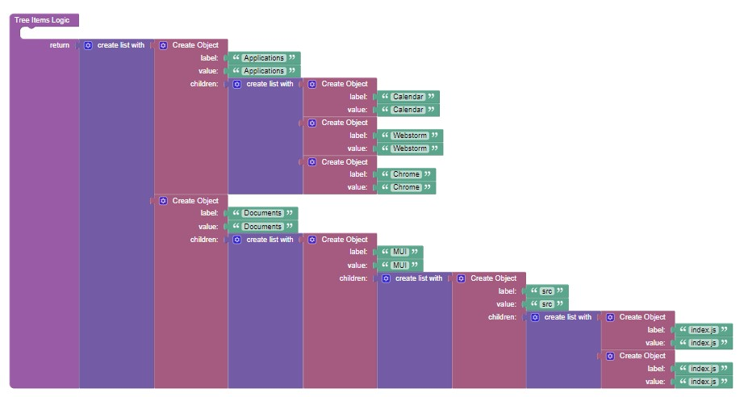

# Tree View

Tree View is a component of the Backendless [UI-Builder](https://backendless.com/developers/#ui-builder). Tree views can be used to represent a file system navigator displaying folders and files.

## Properties

| Property  | Type     | Default Value | Logic            | Data Binding | UI Setting | Description                                                                                                            |
|-----------|----------|---------------|------------------|--------------|------------|------------------------------------------------------------------------------------------------------------------------|
| treeItems | *JSON*   |               | Tree Items Logic | YES          | YES        | Allows to determine tree items. Signature of data: `[{label, value, ?children}]`. Watch [Codeless Examples](#Examples) |
| gap       | *Number* | 10            | Gap Logic        | YES          | YES        | Allows to determine gap for every nested element                                                                       |

## Events

| Name     | Triggers                                       | Context Blocks                   |
|----------|------------------------------------------------|----------------------------------|
| On Click | when a user click on tree element (not folder) | Label: `String`, Value: `String` |


## Actions

| Action    | Inputs | Returns |
|-----------|--------|---------|
| Close All |        |         |
| Open All  |        |         |

## Styles

**Theme**
````
@bl-customComponent-treeView-theme: @themePrimary;
@bl-customComponent-treeView-themeTextColor: @appTextColor;
````

**Dimensions**
```
@bl-customComponent-treeView-list-button-icon-size: 25px;
@bl-customComponent-treeView-list-item-button-border-radius: 3px;
```

**Colors**
````
@bl-customComponent-treeView-list-item-button-selected-background-color: fade(@bl-customComponent-treeView-theme, 8%);
@bl-customComponent-treeView-list-item-button-focus-background-color: fade(@bl-customComponent-treeView-theme, 20%);
@bl-customComponent-treeView-list-item-button-hover-background-color: if(@isLightTheme, rgba(0, 0, 0, 0.04), rgba(255, 255, 255, 0.04));
````

**Others**
```
@bl-customComponent-treeView-button-transition: background-color 0.3s;
```

## <a name="Examples"></a> Codeless Examples

Addition of files and folders in tree items:


