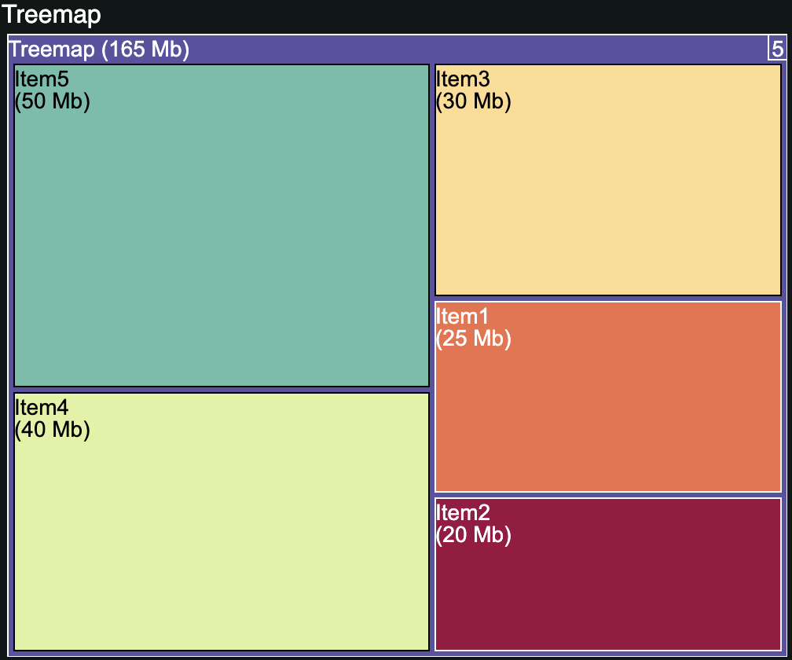
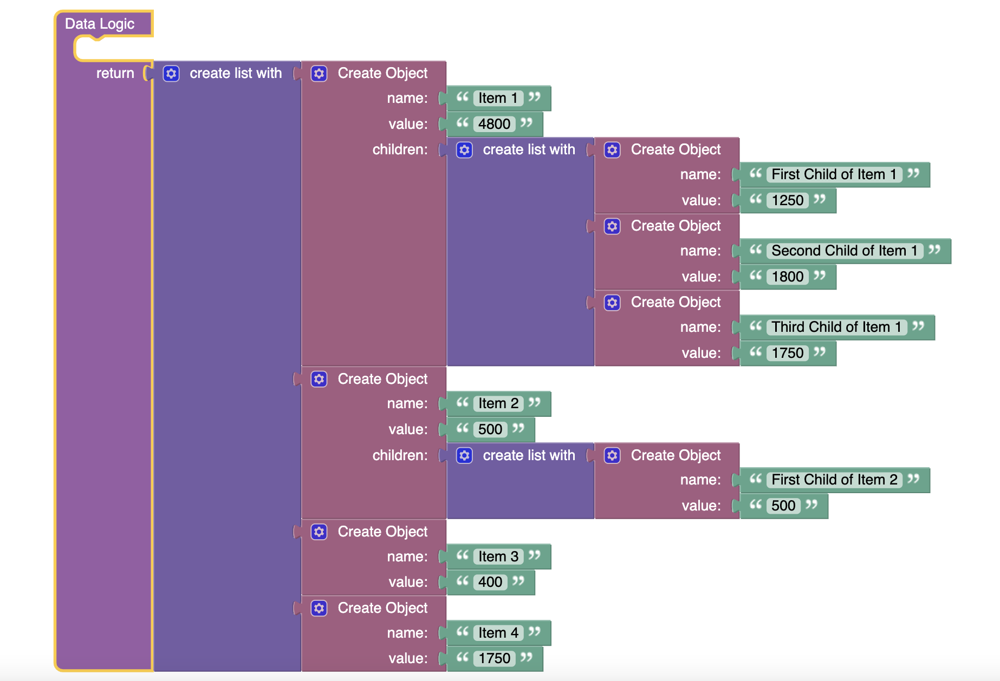

# Treemap
Treemap is a component of Backendless UI-Builder designer. The main purpose of the component is proportional display of data. Also, the [react-d3-treemap](https://github.com/jquintozamora/react-d3-treemap) library is used to create this component.

  

## Properties

| Property                      | Type                                                                             | Default value  | Logic                               | Data Binding | UI Setting | Description                                                                                                                                            |
|-------------------------------|----------------------------------------------------------------------------------|----------------|-------------------------------------|--------------|------------|-------------------------------------------------------------------------------------------------------------------------------------------------------|
| Disabled                      | *Checkbox*                                                                       | false          | Disabled Logic                      | YES          | YES        | This handler allows you to disable the component.                                                                                                                   |
| Label                         | *Text*                                                                           | 'Treemap'      | Label Logic                         | YES          | YES        | This handler allows you to specify a label for the component.                                                                                                       |
| Width                         | *Number*                                                                         | 500            | Width Logic                         | YES          | YES        | This handler allows you to specify the width of the component.                                                                                                      |
| Height                        | *Number*                                                                         | 400            | Height Logic                        | YES          | YES        | This handler allows you to specify the height of the component.                                                                                                     |
| Value Unit                    | *Text*                                                                           |                | Value Unit Logic                    | YES          | YES        | This handler allows you to specify a unit of value for the data.                                                                                                    |
| Padding Inner                 | *Number*                                                                         | 5              | Padding Inner Logic                 | YES          | YES        | This handler allows you to specify the size of the gap between elements.                                                                                            |
| Name Font Size                | *Number*                                                                         | 14             | Name Font Size Logic                | YES          | YES        | This handler allows you to specify the font size of the name of each treemap element.                                                                               |
| Data                          | *JSON*                                                                           | []             | Data Logic                          | YES          | YES        | This handler allows you to add treemap items to display. Watch [Codeless Examples.](#Examples). Signature of item: `{name: String, value: Number, children: Array}` |
| Value Visibility              | *Checkbox*                                                                       | true           | Value Visibility  Logic             | YES          | YES        | This handler allows you to control the visibility of a value.                                                                                                       |
| Breadcrumb Visibility         | *Checkbox*                                                                       | true           | Breadcrumb Visibility Logic         | YES          | YES        | This handler allows you to control breadcrumb visibility.                                                                                                           |
| Number Of Children Visibility | *Checkbox*                                                                       | true           | Number Of Children Visibility Logic | YES          | YES        | This handler allows you to control the visibility of the number of children.                                                                                        |
| Color Model                   | *Select*   "Value" \| "Depth" \| "Number Of Children" \| "One Each Children" | "Depth"        | Color Model Logic                   | YES          | YES        | This handler allows you to specify the color model of a component.                                                                                                  |
| Number Of Children Placement  | *Select*   "Top Right" \| "Bottom Right"                                     | "Bottom Right" | Number Of Children Placement Logic  | YES          | YES        | This handler allows you to specify the placement of the number of children.                                                                                         |

##  Codeless Examples

Adding of markers on treemap:

