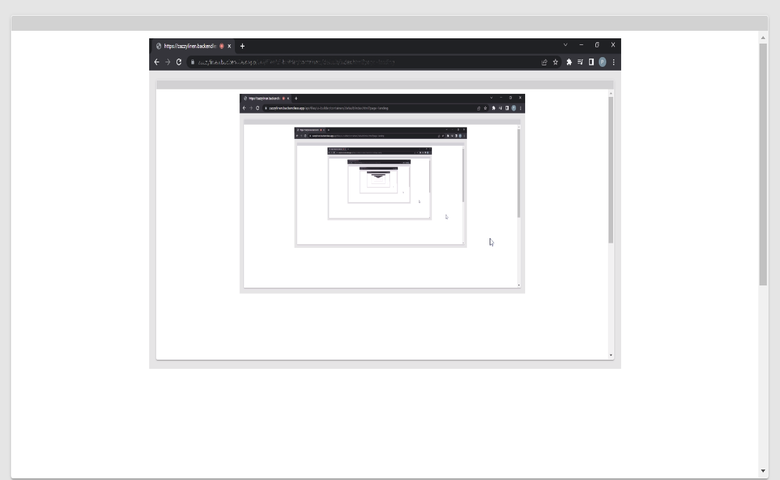

# Video Recorder

Video Recorder is a component of Backendless UI-Builder designer. This allows to record screen and use the recorded file.


<p align="center">
  
</p>

## Properties

| Property    | Type       | Default Value    | Logic           | Data Binding | UI Setting | Description                                                  |
|-------------|------------|------------------|-----------------|--------------|------------|--------------------------------------------------------------|
| Width       | *Number*   | 720              |                 | NO           | YES        | Controls width of component, in 'px'.                        |
| Height      | *Number*   | 480              |                 | NO           | YES        | Controls height of component, in 'px'.                       |
| Allow Audio | *Checkbox* | `true`           |                 | NO           | YES        | Controls allow recording audio from screen, page, etc.       |
| File Name   | *Text*     | "Recorded Video" | File Name Logic | YES          | YES        | This is a handler to control the name of the downloaded file.|

## Events

| Name               | Triggers                                  | Context Blocks                            |
|--------------------|-------------------------------------------|-------------------------------------------|
| On Start Recording | When the recording is started             |                                           |
| On Stop Recording  | When the recording is stopped             |                                           |
| On Download file   | When the recorded file starts downloading | Blob File: `{size: Number, type: String}` |

## Actions

| Action                                   | Inputs                     | Returns               |
|------------------------------------------|----------------------------|-----------------------|
| Start record of Video Recorder           |                            |                       |
| Stop record of Video Recorder            |                            |                       |
| Download recorded file of Video Recorder |                            |                       |
| Get Blob of Video Recorder               |                            | `Blob`: recorded blob |

## Styles

**Color**
````
@bl-customComponent-videoRecorder-video-background: black;
````
