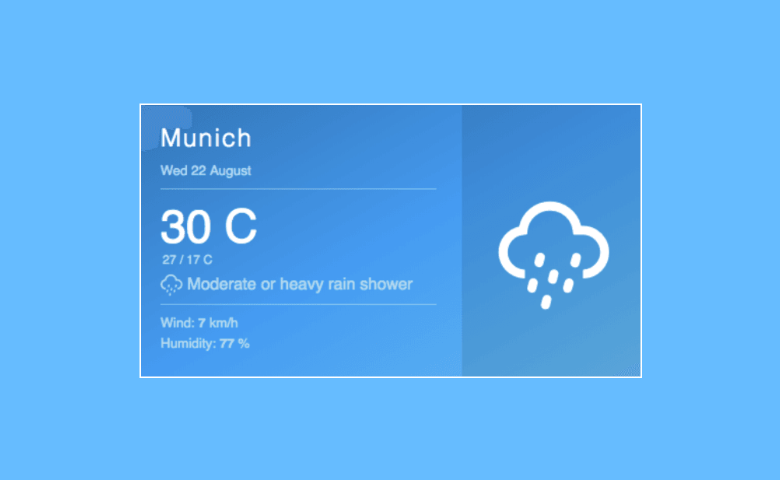
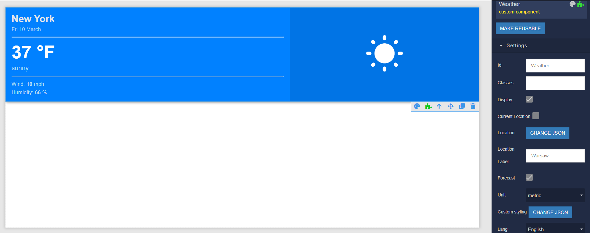

# Weather

Weather is the component that can be used in Backendless [UI-Builder](https://backendless.com/developers/#ui-builder). It allows you to create a weather widget for the current day or with the addition of a forecast in your application. You can apply your own settings for weather display or leave the default. You can find more information about the widget in the [React Open Weather](https://www.jsdelivr.com/package/npm/react-open-weather?path=src%2Fjs) library.

<p align="center">
  
</p>

## Properties

| Property                                | Type                                                                                                                                | Default value                           | Logic                | Data Binding | UI Setting | Description                                                                                                                                                        |
|-----------------------------------------|-------------------------------------------------------------------------------------------------------------------------------------|-----------------------------------------|----------------------|--------------|------------|--------------------------------------------------------------------------------------------------------------------------------------------------------------------|
| Current Location <br> `currentLocation` | *Checkbox*                                                                                                                          | `false`                                 |                      | NO           | YES        | Controls the display of weather by current location.                                                                                                               |
| City <br> `city`                        | *Text*                                                                                                                              | `New York`                              |                      | NO           | YES        | Controls the city name to display the weather for it.                                                                                                              |
| Coordinates <br> `coords`               | *JSON*                                                                                                                              | `{"lat": 40.730610, "lng": -73.935242}` | Coordinates Logic    | YES          | YES        | Specifies a JSON object containing the latitude and longitude coordinates data to display the weather for them. Signature of coords: `{lat: Number, lng: Number}`. |
| Forecast <br> `forecast`                | *Checkbox*                                                                                                                          | `false`                                 |                      | NO           | YES        | Controls the display the weather forecast.                                                                                                                         |
| Unit <br> `unit`                        | *Select* <br> [`standard`, `metric`, `imperial`]                                                                                    | `standard`                              |                      | NO           | YES        | Controls the unit of measurement.                                                                                                                                  |
| Custom styling <br> `theme`             | *JSON*                                                                                                                              | `{}`                                    | Custom Styling Logic | NO           | YES        | Specifies a JSON object containing the custom styling data. Signature of theme in [Theme Example](#Theme). Watch [Codeless Examples](#Examples).                   |
| Lang <br> `lang`                        | *Select* <br> [`ca`, `cs`, `en`, `es`, `de`, `sl`, `ja`, `zh_tw`, `uk`, `fr`, `it`, `pl`, `tr`, `da`, `pt_br`, `pt`, `nl`, `nl_be`] | `en`                                    |                      | NO           | YES        | Controls the language to show `humidity` and `wind speed`.                                                                                                         |

## Settings

| Name    | Type   | Default Value | Required | Description                              |
|---------|--------|---------------|----------|------------------------------------------|
| API_KEY | *Text* |               | YES      | API key needed to use Weather component. |

## Before Usage

Before usage, you need:

1. Create an account if you don't have on [OpenWeather](https://openweathermap.org/).
2. Get your API key for use the component. More information about obtaining a key can be found [here](https://openweathermap.org/appid).
3. Next, in the SETTINGS of the UI-Builder, set the received API key in a special field(as shown in the example below). The component is ready to go.

<p align="center">
  
</p>

## Styles

**Dimensions**
```
@bl-customComponent-weather-size: 100%;
```

## Theme

```
{
  "fontFamily": "Helvetica, sans-serif",
  "gradientStart": "#0181C2",
  "gradientMid": "#04A7F9",
  "gradientEnd": "#4BC4F7",
  "locationFontColor": "#FFF",
  "todayTempFontColor": "#FFF",
  "todayDateFontColor": "#B5DEF4",
  "todayRangeFontColor": "#B5DEF4",
  "todayDescFontColor": "#B5DEF4",
  "todayInfoFontColor": "#B5DEF4",
  "todayIconColor": "#FFF",
  "forecastBackgroundColor": "#FFF",
  "forecastSeparatorColor": "#DDD",
  "forecastDateColor": "#777",
  "forecastDescColor": "#777",
  "forecastRangeColor": "#777",
  "forecastIconColor": "#4BC4F7",
  "containerDropShadow": "0px 3px 6px 0px rgba(50, 50, 50, 0.5)"
}
```

## Examples

Below is a Codeless Example highlighting how to use the Weather component:

<p align="center">
  
</p>

<p align="center">
  
</p>

<p align="center">
  
</p>

<details>
<summary>Try yourself</summary>

```
<block xmlns="http://www.w3.org/1999/xhtml" type="create_object" id="Qy:$nJe@i%Tt+v;?|,Pp" x="186.75" y="100"><mutation><properties><item id="property" prop-name="fontFamily"></item><item id="property" prop-name="gradientStart"></item><item id="property" prop-name="gradientMid"></item><item id="property" prop-name="gradientEnd"></item><item id="property" prop-name="locationFontColor"></item><item id="property" prop-name="todayTempFontColor"></item><item id="property" prop-name="todayDateFontColor"></item><item id="property" prop-name="todayRangeFontColor"></item><item id="property" prop-name="todayDescFontColor"></item><item id="property" prop-name="todayInfoFontColor"></item><item id="property" prop-name="todayIconColor"></item><item id="property" prop-name="forecastBackgroundColor"></item><item id="property" prop-name="forecastSeparatorColor"></item><item id="property" prop-name="forecastDateColor"></item><item id="property" prop-name="forecastDescColor"></item><item id="property" prop-name="forecastRangeColor"></item><item id="property" prop-name="forecastIconColor"></item><item id="property" prop-name="containerDropShadow"></item></properties></mutation><value name="create_object_mutator_container_properties_stack_property0"><block type="text" id="QB~tI`}29HP4#IK3t.uj"><field name="TEXT">cursive</field></block></value><value name="create_object_mutator_container_properties_stack_property1"><block type="text" id="$$$MS~e.!)U)?iE{@AzC"><field name="TEXT">#00d4ff</field></block></value><value name="create_object_mutator_container_properties_stack_property2"><block type="text" id="?9)|xE]fT3m^yA4-*vt!"><field name="TEXT">#090979</field></block></value><value name="create_object_mutator_container_properties_stack_property3"><block type="text" id="GaLpt(O;uEicviPWVd|?"><field name="TEXT">#020024</field></block></value><value name="create_object_mutator_container_properties_stack_property4"><block type="text" id="zC@DGip{PU|?DXnWq-54"><field name="TEXT">#cdfbf8</field></block></value><value name="create_object_mutator_container_properties_stack_property5"><block type="text" id="Evo~5v|t}dqac%}oJ8ah"><field name="TEXT">#FFF</field></block></value><value name="create_object_mutator_container_properties_stack_property6"><block type="text" id="3NA}ymZ]mWiRi^nlCL$t"><field name="TEXT">#cdfbf8</field></block></value><value name="create_object_mutator_container_properties_stack_property7"><block type="text" id="q@@1h/]s!l%3iBGQJ+4G"><field name="TEXT">#FFF</field></block></value><value name="create_object_mutator_container_properties_stack_property8"><block type="text" id="~/jBpaSU!yJbD:k.OvLO"><field name="TEXT">#cdfbf8</field></block></value><value name="create_object_mutator_container_properties_stack_property9"><block type="text" id="EwRRGjuQNV|_2(q}n[D7"><field name="TEXT">#cdfbf8</field></block></value><value name="create_object_mutator_container_properties_stack_property10"><block type="text" id="6PRaE?t_ys*+rKF3W0h@"><field name="TEXT">#d8fbf9</field></block></value><value name="create_object_mutator_container_properties_stack_property11"><block type="text" id="`3G9P}Eu:8vhmYz)W=R0"><field name="TEXT">#d5ecf7</field></block></value><value name="create_object_mutator_container_properties_stack_property12"><block type="text" id="PDFfO`=j8T=CdeBHqVLP"><field name="TEXT">#00d4ff</field></block></value><value name="create_object_mutator_container_properties_stack_property13"><block type="text" id=",45qVWTIqZZc:bsj}yf("><field name="TEXT">#020024</field></block></value><value name="create_object_mutator_container_properties_stack_property14"><block type="text" id="qOG~B=vO?8kP.XrV!|3R"><field name="TEXT">#020024</field></block></value><value name="create_object_mutator_container_properties_stack_property15"><block type="text" id="Q{zQ6C/Qh|-=!A2y(`i$"><field name="TEXT">#020024</field></block></value><value name="create_object_mutator_container_properties_stack_property16"><block type="text" id="kJQPzmgQ}$KUFk3^M]f8"><field name="TEXT">#090979</field></block></value><value name="create_object_mutator_container_properties_stack_property17"><block type="text" id="0R4T1Sy2o[tM-7=Q{CT("><field name="TEXT">0px 3px 6px 0px rgba(70, 70, 70, 0.5)</field></block></value></block>
```
</details>
