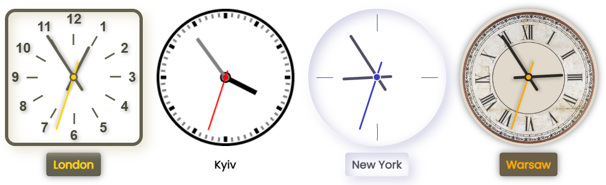
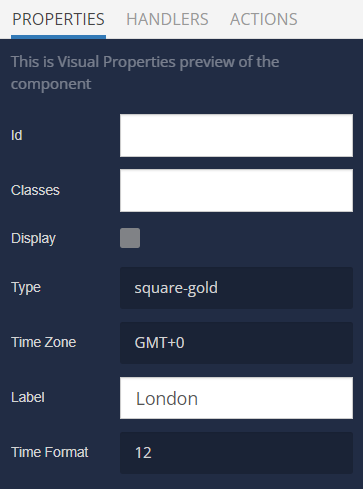

# World Clock

World Clock is the component that can be used in Backendless [UI-Builder](https://backendless.com/developers/#ui-builder). It provides several options for displaying time in different time zones, as well as options for setting the time zone and labels for them.

<p align="center">
  
</p>

## Properties

| Property                              | Type                                                                                                                                                                                                                                                                                                                                                                                                                                                          | Default value              | Logic       | Data Binding | UI Setting | Description                                                                                      |
|---------------------------------------|---------------------------------------------------------------------------------------------------------------------------------------------------------------------------------------------------------------------------------------------------------------------------------------------------------------------------------------------------------------------------------------------------------------------------------------------------------------|----------------------------|-------------|--------------|------------|--------------------------------------------------------------------------------------------------|
| Type <br> `type`                      | *Select* <br> [square-gold: `analog-gold`, circle-classic: `analog-classic`, circle-modern: `analog-modern`, circle-vintage: `analog-vintage`, digital-modern: `digital-modern`, digital-pixel: `digital-pixel`, digital-techno: `digital-techno`, digital-flip: `digital-flip`]                                                                                                                                                                              | square-gold: `analog-gold` |             | NO           | YES        | Controls the type of world clock.                                                                |
| Time Zone <br> `timezone`             | *Select* <br> [GMT-12: `-12:00`, GMT-11: `-11:00`, GMT-10: `-10:00`, GMT-9: `-09:00`, GMT-8: `-08:00`, GMT-7: `-07:00`, GMT-6: `-06:00`, GMT-5: `-05:00`, GMT-4: `-04:00`, GMT-3: `-03:00`, GMT-2: `-02:00`, GMT-1: `-01:00`, GMT+0: `+00:00`, GMT+1: `+01:00`, GMT+2: `+02:00`, GMT+3: `+03:00`, GMT+4: `+04:00`, GMT+5: `+05:00`, GMT+6: `+06:00`, GMT+7: `+07:00`, GMT+8: `+08:00`, GMT+9: `+09:00`, GMT+10: `+10:00`, GMT+11: `+11:00`, GMT+12: `+12:00`] | GMT+0: `+00:00`            |             | NO           | YES        | Controls a time zone for the world clock.                                                        |
| Label <br> `label`                    | *Text*                                                                                                                                                                                                                                                                                                                                                                                                                                                        | "London"                   | Label Logic | YES          | YES        | Specifies the logic to determine the name of a location/city/etc to display it in the component. |
| Time Format <br> `timeFormat`         | *Select* <br> [`12`, `24`]                                                                                                                                                                                                                                                                                                                                                                                                                                    | `12`                       |             | NO           | YES        | Controls a time format for the world clock(only for digital types).                              |
| Display Seconds <br> `displaySeconds` | *Checkbox*                                                                                                                                                                                                                                                                                                                                                                                                                                                    | `true`                     |             | NO           | YES        | Controls the display the seconds(second hand).                                                   |

## Events

| Name                | Triggers                                    | Context Blocks   |
|---------------------|---------------------------------------------|------------------|
| On Second(s) Change | when the time changes(updated every second) | `{time: Object}` |
| On Minute(s) Change | when the time changes(updated every minute) | `{time: Object}` |
| On Hour(s) Change   | when the time changes(updated every hour)   | `{time: Object}` |

## Styles

````
@bl-customComponent-worldClock-font-family: 'Poppins', sans-serif;
@bl-customComponent-worldClock-font-family-digital: 'Digital-7', arial;
@bl-customComponent-worldClock-margin: 10px;
@bl-customComponent-worldClock-white-color: #fff;
@bl-customComponent-worldClock-z-normal: 1;
@bl-customComponent-worldClock-z-tooltip: 10;
@bl-customComponent-worldClock-label-margin-top: 10px;
@bl-customComponent-worldClock-label-padding: 5px 10px;
@bl-customComponent-worldClock-label-border-radius: 4px;

@bl-customComponent-worldClock-analog-width: 200px;
@bl-customComponent-worldClock-analog-height: 200px;
@bl-customComponent-worldClock-analog-hour-width: 70px;
@bl-customComponent-worldClock-analog-hour-height: 100px;
@bl-customComponent-worldClock-analog-hour-before-width: 0.25rem;
@bl-customComponent-worldClock-analog-hour-before-height: 4.5rem;
@bl-customComponent-worldClock-analog-minute-width: 96px;
@bl-customComponent-worldClock-analog-minute-height: 146px;
@bl-customComponent-worldClock-analog-minute-before-width: 0.25rem;
@bl-customComponent-worldClock-analog-minute-before-height: 6rem;
@bl-customComponent-worldClock-analog-second-width: 90px;
@bl-customComponent-worldClock-analog-second-height: 160px;
@bl-customComponent-worldClock-analog-second-before-width: 0.135rem;
@bl-customComponent-worldClock-analog-second-before-height: 6.5rem;
@bl-customComponent-worldClock-analog-hand-border-radius: 0.75rem;
@bl-customComponent-worldClock-analog-hand-shadow: 2px 2px 5px rgba(0, 0, 0, 0.3);
@bl-customComponent-worldClock-analog-rice-width: 1.5rem;
@bl-customComponent-worldClock-analog-rice-height: 1px;
@bl-customComponent-worldClock-analog-rice-transform: translateX(-50%) rotate(90deg);
@bl-customComponent-worldClock-analog-rice-indent-first: 1.25rem;
@bl-customComponent-worldClock-analog-rice-indent-second: 0.75rem;
@bl-customComponent-worldClock-analog-rice-indent-half: 50%;
@bl-customComponent-worldClock-analog-rounder-size: 0.75rem;
@bl-customComponent-worldClock-analog-rounder-border-radius: 50%;

@bl-customComponent-worldClock-analog-gold-hue: 50;
@bl-customComponent-worldClock-analog-gold-label-shadow: 0px 0px 10px rgba(0, 0, 0, 0.5);
@bl-customComponent-worldClock-analog-gold-border-radius: 15px;
@bl-customComponent-worldClock-analog-gold-rotation: 30deg;
@bl-customComponent-worldClock-analog-gold-number-after-width: 0.125rem;
@bl-customComponent-worldClock-analog-gold-number-after-height: 1rem;
@bl-customComponent-worldClock-analog-gold-number-after-transform: rotate(-90deg) translateX(20px);
@bl-customComponent-worldClock-analog-gold-number-after-margin-left: -20px;

@bl-customComponent-worldClock-analog-vintage-hue: 40;
@bl-customComponent-worldClock-analog-vintage-shadow: 0px 0px 10px rgba(0, 0, 0, 0.5);
@bl-customComponent-worldClock-analog-vintage-border-radius: 50%;

@bl-customComponent-worldClock-analog-modern-hue: 240;
@bl-customComponent-worldClock-analog-modern-border-radius: 50%;

@bl-customComponent-worldClock-digital-modern-hue: 240;
@bl-customComponent-worldClock-digital-modern-text-shadow: 2px 2px 5px rgba(0, 0, 0, 0.3);
@bl-customComponent-worldClock-digital-modern-border-radius: 15px;
@bl-customComponent-worldClock-digital-modern-font-size: 3rem;
@bl-customComponent-worldClock-digital-modern-padding: 5px 10px;
@bl-customComponent-worldClock-digital-modern-digit-width: calc(2ch + 2px);
@bl-customComponent-worldClock-digital-modern-separator-font-size: 1.5rem;
@bl-customComponent-worldClock-digital-modern-separator-margin: 0 0.5rem;
@bl-customComponent-worldClock-digital-modern-ampm-font-size: 0.5rem;
@bl-customComponent-worldClock-digital-modern-ampm-margin: 10px 0 0 2px;

@bl-customComponent-worldClock-digital-pixel-hue: 40;
@bl-customComponent-worldClock-digital-pixel-shadow: 0px 0px 10px rgba(0, 0, 0, 0.5);
@bl-customComponent-worldClock-digital-pixel-border-padding: 10px;
@bl-customComponent-worldClock-digital-pixel-border-radius: 4px;
@bl-customComponent-worldClock-digital-pixel-clock-padding: 5px 10px;
@bl-customComponent-worldClock-digital-pixel-digit-width: 30px;
@bl-customComponent-worldClock-digital-pixel-digit-margin-right: 10px;
@bl-customComponent-worldClock-digital-pixel-segment-width: 10px;
@bl-customComponent-worldClock-digital-pixel-segment-height: 10px;
@bl-customComponent-worldClock-digital-pixel-ampm-font-weight: 600;
@bl-customComponent-worldClock-digital-pixel-ampm-line-height: 1.2rem;
@bl-customComponent-worldClock-digital-pixel-ampm-color: rgb(0, 0, 255);
@bl-customComponent-worldClock-digital-pixel-ampm-font-size: 1.5rem;
@bl-customComponent-worldClock-digital-pixel-ampm-font-weight: 600;
@bl-customComponent-worldClock-digital-pixel-ampm-margin: 0.5rem;

@bl-customComponent-worldClock-digital-techno-clock-margin: 10px;
@bl-customComponent-worldClock-digital-techno-clock-border-radius: 10px;
@bl-customComponent-worldClock-digital-techno-clock-background: #0d1621;
@bl-customComponent-worldClock-digital-techno-clock-padding: 20px 20px 5px 20px;
@bl-customComponent-worldClock-digital-techno-calendar-font-size: 2rem;
@bl-customComponent-worldClock-digital-techno-calendar-gap: 33px;
@bl-customComponent-worldClock-digital-techno-calendar-padding: 0 10px;
@bl-customComponent-worldClock-digital-techno-row-gap: 10px;
@bl-customComponent-worldClock-digital-techno-hour-font-size: 7rem;
@bl-customComponent-worldClock-digital-techno-ampm-font-size: 2.5rem;
@bl-customComponent-worldClock-digital-techno-ampm-gap: 10px;
@bl-customComponent-worldClock-digital-techno-ampm-margin-bottom: 25px;
@bl-customComponent-worldClock-digital-techno-digit-width: 100%;
@bl-customComponent-worldClock-digital-techno-digit-color-first: #243820;
@bl-customComponent-worldClock-digital-techno-digit-color-second: #2bd012;
@bl-customComponent-worldClock-digital-techno-digit-p-margin: 0;
@bl-customComponent-worldClock-digital-techno-font-size-media: 0.7rem;
@bl-customComponent-worldClock-digital-techno-hour-font-size-media: 4rem;
@bl-customComponent-worldClock-digital-techno-padding-media: 5px;

@bl-customComponent-worldClock-digital-flip-label-color: rgb(255, 253, 255);
@bl-customComponent-worldClock-digital-flip-background: rgb(0, 115, 116);
@bl-customComponent-worldClock-digital-flip-border-radius: 3px;
@bl-customComponent-worldClock-digital-flip-font-size: 1.5rem;
@bl-customComponent-worldClock-digital-flip-label-margin: 0;
@bl-customComponent-worldClock-digital-flip-label-font-size: 1rem;
@bl-customComponent-worldClock-digital-flip-clock-padding: 10px 5px 0px;
@bl-customComponent-worldClock-digital-flip-container-width: 34px;
@bl-customComponent-worldClock-digital-flip-container-height: 48px;
@bl-customComponent-worldClock-digital-flip-container-perspective-origin: 50% 50%;
@bl-customComponent-worldClock-digital-flip-container-perspective: 300px;
@bl-customComponent-worldClock-digital-flip-container-background: rgb(16, 21, 23);
@bl-customComponent-worldClock-digital-flip-container-border-radius: 3px;
@bl-customComponent-worldClock-digital-flip-container-box-shadow: 0px 10px 10px -10px rgb(255, 253, 255);
@bl-customComponent-worldClock-digital-flip-container-margin: 0 3px;
@bl-customComponent-worldClock-digital-flip-ampm-font-size: 1.1rem;
@bl-customComponent-worldClock-digital-flip-card-width: 100%;
@bl-customComponent-worldClock-digital-flip-card-height: 50%;
@bl-customComponent-worldClock-digital-flip-card-border: 1px solid whitesmoke;
@bl-customComponent-worldClock-digital-flip-card-span-color: rgb(255, 253, 255);
@bl-customComponent-worldClock-digital-flip-card-sub-border: 0.1px solid rgba(255, 253, 255, 0.5);
@bl-customComponent-worldClock-digital-flip-card-border-radius: 3px;
@bl-customComponent-worldClock-digital-flip-upp-card-transform: translateY(50%);
@bl-customComponent-worldClock-digital-flip-low-card-transform: translateY(-50%);
@bl-customComponent-worldClock-digital-flip-unfold-transform-origin: 50% 0%;
@bl-customComponent-worldClock-digital-flip-unfold-transform: rotateX(180deg);
@bl-customComponent-worldClock-digital-flip-unfold-animation: unfold 1s cubic-bezier(0.455, 0.03, 0.515, 0.955) 0s 1 normal forwards;
@bl-customComponent-worldClock-digital-flip-fold-transform-origin: 50% 100%;
@bl-customComponent-worldClock-digital-flip-fold-transform: rotateX(0deg);
@bl-customComponent-worldClock-digital-flip-fold-animation: fold 1s cubic-bezier(0.455, 0.03, 0.515, 0.955) 0s 1 normal forwards;
@bl-customComponent-worldClock-digital-flip-semicolon-width: 4px;
@bl-customComponent-worldClock-digital-flip-semicolon-height: 48px;
@bl-customComponent-worldClock-digital-flip-semicolon-border-radius: 50%;
@bl-customComponent-worldClock-digital-flip-semicolon-span-height: 4px;
@bl-customComponent-worldClock-digital-flip-semicolon-color: rgb(255, 253, 255);
````

## Examples

### Usage

Below is a Codeless Example highlighting how to use the World Clock component:

<p align="center">
  
</p>

<p align="center">
  
</p>
