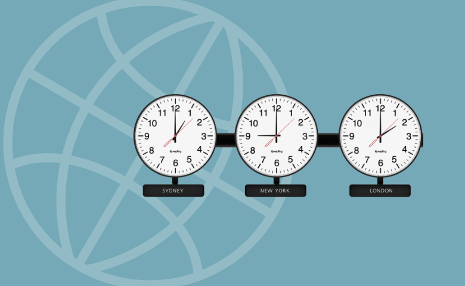

# World Clock

World Clock is the component that can be used in Backendless [UI-Builder](https://backendless.com/developers/#ui-builder). It provides several options for displaying time in different time zones, as well as options for setting the time zone and labels for them.

  

## Properties

## Styles

## Examples

Below is a Codeless Example highlighting how to use the World Clock component:

  

